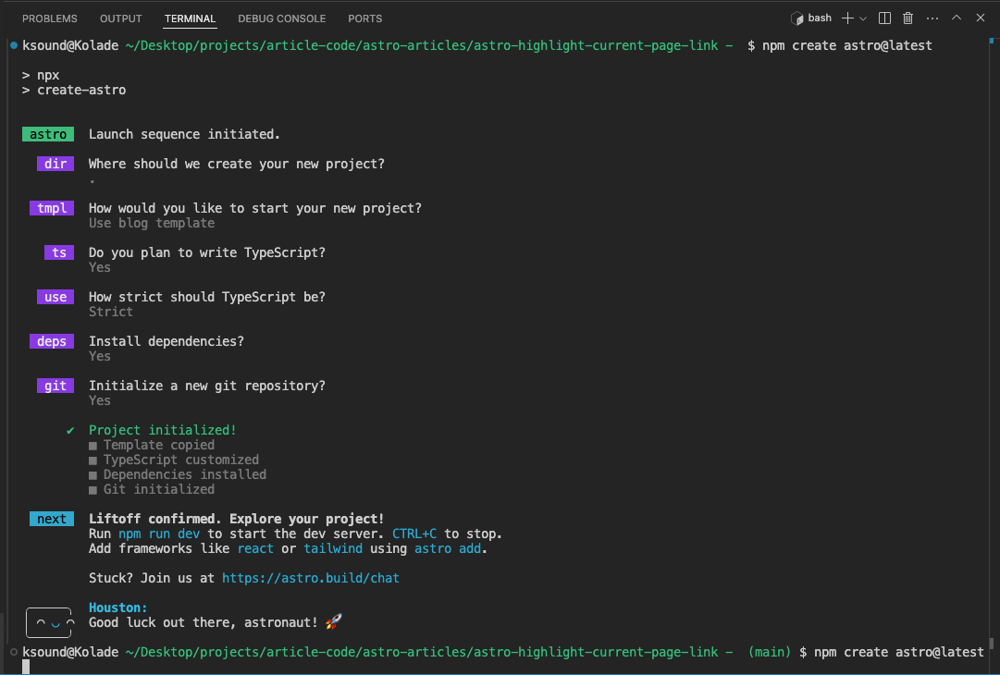
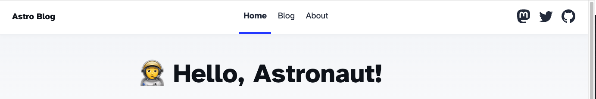
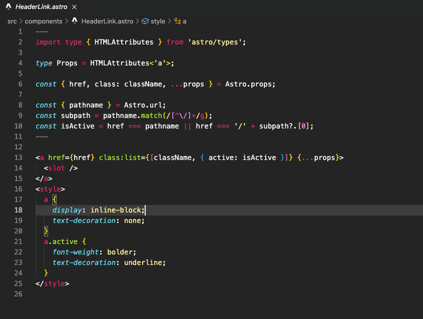
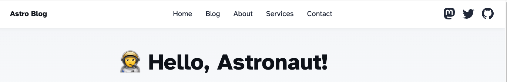
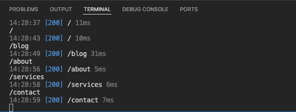

Highlighting the current page on any website can improve the overall user experience because the user gets to know which page they are by looking at the navbar.

A popular and one of many ways to do this is to get the current `pathname` and style the navlink based on that.

Astro has a built-in way for you to get the current pathname, making the problem half-solved.

So, let's look at how to get access to the current page pathname and use that to highlight the current page link.

## The Astro Built-in Current Page Link Highlight

To get started, I've installed a brand new Astro project using the blog template.

These are the choices I made in the prompts after running `npm create astro@latest` in the terminal



Here's the navigation bar that comes with the installation:



As you can see, the installation already has that feature in it through a `HeaderLink` component. Here's that code:



Here's how it was used to implement the feature:

```js
<HeaderLink href="/">Home</HeaderLink>
<HeaderLink href="/blog">Blog</HeaderLink>
<HeaderLink href="/about">About</HeaderLink>
```

## How to Highlight the Current Page Link in Astro

I'll delete the `HeaderLink` component file and reimplement the feature with a different style of navbar. This approach will be way simpler and more understandable than the built-in.

Here's what I have inside the `components/Header.astro`:

```html
<ul class="internal-links">
  <li><a href="/">Home</a></li>
  <li><a href="/blog">Blog</a></li>
  <li><a href="/about">About</a></li>
</ul>
```

I will also create extra services and contact pages. So the updated navbar code will be this:

```html
<ul class="internal-links">
  <li><a href="/">Home</a></li>
  <li><a href="/blog">Blog</a></li>
  <li><a href="/about">About</a></li>
  <li><a href="/services">Services</a></li>
  <li><a href="/contact">Contact</a></li>
</ul>
```

I will also add some extra styles to the `style` tag in the `Header.astro` file

```css
nav ul {
  display: flex;
  list-style-type: none;
  gap: 1rem;
}
```

Here's what the navbar and navlinks look like now:



The next thing to do is to access `pathname` property from the Astro built-in `Astro.url` object inside the codefence of the `Header.astro` file. This way, you get access to the path portion of the current URL, starting with a forward slash ('/').

```js
const pathname = Astro.url.pathname;
```

If you log the `pathname` variable to the console and visit the pages on the website, you get to see the pathnames of the pages in lowercase starting with the forward slash:

```js
const pathname = Astro.url.pathname;
console.log(pathname);
```



Now you can style the navlinks with that pathname.

To do that, you can use a conditional to dynamically apply a `class` to each item of the navbar with the `pathname` variable

```js
<li><a href="/" class={pathname === "/" ? "active" : ""}>Home</a></li>
<li><a href="/blog" class={pathname === "/blog" ? "active" : ""}>Blog</a></li>
<li><a href="/about" class={pathname === "/about" ? "active" : ""}>About</a></li>
<li><a href="/services" class={pathname === "/services" ? "active" : ""}>Services</a></li>
<li><a href="/contact" class={pathname === "/contact" ? "active" : ""}>Contact</a></li>
```

With this, once the user hits any of the pages, the class `active` is applied to the navlink of that page.

There's already a style for that in the Astro blog template:

```css
nav a.active {
  text-decoration: none;
  border-bottom-color: var(--accent);
}
```

Here's the result in the browser


That's how you can highlight the current page link in Astro! YOu can grab the final code in this [GitHub repo](https://github.com/Ksound22/highlight-navlink-in-astro 'Click to access full article code').

Check out a similar article on [how to highlight the current page link in Next.js](https://www.koladechris.com/blog/how-to-highlight-the-active-link-in-next.js 'Click to read the article').
