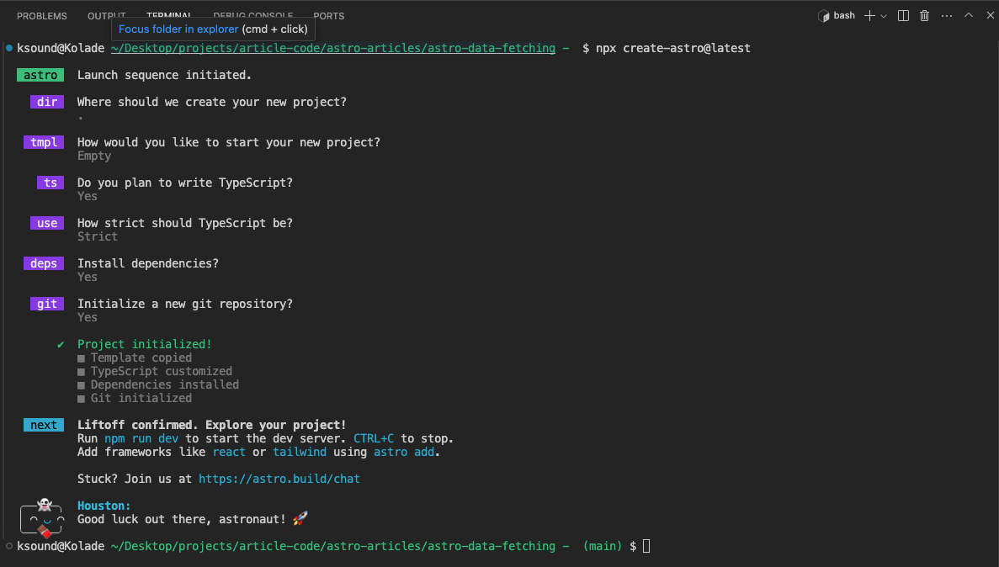
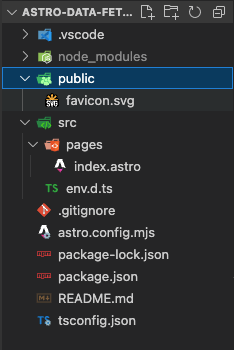
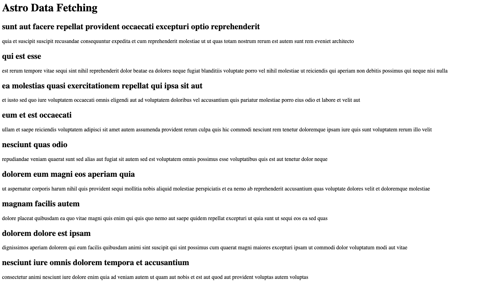

import NoteAlertBox from '../../components/blog-post-components/NoteAlertBox.astro';
import TipAlertBox from '../../components/blog-post-components/TipAlertBox.astro';

Like I said on Twitter (now X) a while ago, Astro is the only framework that makes everything ridiculously uncomplicated for you.

In this article, I want to show you how ridiculously uncomplicated it is to fetch data in Astro using a simple API from JSON Placeholder.

## How to Fetch Data in Astro

To get started, I have installed an empty Astro project. Here are the prompt choices I made during the installation:



Here's the initial folder structure of the project:



You only need the traditional `fetch` API to fetch the data. Open up a code fence inside `src/pages/index.astro` and paste this inside it:

```js
---
fetch("https://jsonplaceholder.typicode.com/posts")
 .then(res => res.json())
 .then(data => console.log(data))
---
```

That's all you need, but Astro has a beautiful way to enhance and simplify this. You might also want to pass the data into the template so you can see it in the browser. Keep reading so I can show you this.

<NoteAlertBox>
  The `data` from the code above will not be logged into the browser console but
  the server console. That's because every code in the code fence is rendered on
  the server.
</NoteAlertBox>

To simplify the data fetching, Astro has a top level `await` built-in, so you don't need an async function to use it. YOu can use this for the data fetching:

```js
const response = await fetch('https://jsonplaceholder.typicode.com/posts');
const data = await response.json();

console.log(data);
```

In the template, you can stringify the data for a start:

```js
Data: {
  JSON.stringify(data);
}
```

Then map through it:

```html
<body>
  <h1>Astro Data Fetching</h1>
  {data.map((post:any) => (
  <div>
    <h2>{post.title}</h2>
    <p>{post.body}</p>
  </div>
  ))}
</body>
```



<TipAlertBox>
  If you want the data client-rendered, you can open up a script tag and fetch
  the data there.
</TipAlertBox>

Thank you for reading!

If you want to fetch the data from a headless CMS, look through the Astro docs for data fetching from a CMS, and the CMS you want to use.
