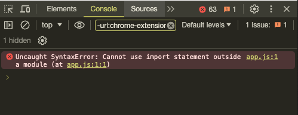
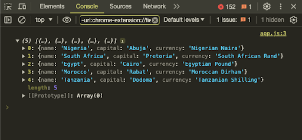
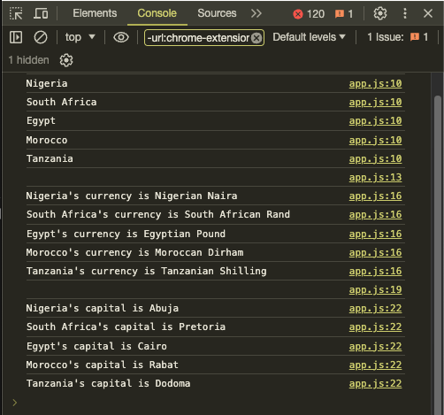
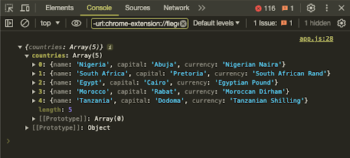

import NewsletterFrameInPost from '../../components/blog-post-components/NewsletterFrameInPost.astro';
import BlogPostAlertBox from '../../components/blog-post-components/BlogPostAlertBox.astro';

JSON provides a lightweight and easy-to-parse data format for JavaScript projects. JavaScript's native support for JSON enables efficient data handling and storage, making it easy to use in your codebases.

Importing JSON into a JavaScript file is not as straightforward as it is in frontend frameworks like React and Vue and a JavaScript runtime like Node JS.

Let's examine the error that occurs when you try to import a JSON file into a vanilla JavaScript file directly and how you can fix it by correctly importing the JSON file. We'll also examine a popular alternative to directly importing a JSON file in vanilla JavaScript.

## The Problem: Directly Importing JSON Files in a Vanilla JavaScript File throws a `SyntaxError` Error

In frontend frameworks like React and Vue, you can easily import any JSON file into your JS or JSX file using the `import` and `from` keywords:

```js
Import myJSONFile from `someFolder/someFile.json`
```

In a Node JS environment, you can import a JSON file the same way if you've specified `type module` in your `package.json` file:

```js
{
 "name": "my-project",
 "version": "1.0.0",
 "description": "Some description",
 "main": "server.js",
 "type": "module",
}
```

But if you do the same in a vanilla JavaScript codebase, you'll get the error `Uncaught SyntaxError: Cannot use import statement outside a module (at app.js:1:1)`:



Let's look at how to correctly import a JSON file into a vanilla JavaScript file and subsequently fix that error.

<NewsletterFrameInPost />

## How to Correctly Import a JSON File into a Vanilla JavaScript File

The process starts from your `index.js` file, `app.js` file, or any JS file in which you want to do the import.

Make sure you specify `type module` in your script tag before you link the JavaScript file:

```js
<script type="module" src="app.js"></script>
```

Then inside the JavaScript file, import the JSON file using the `import` and `from` statements as usual, the add `assert { type: 'json' }` to the end

```js
import JSONFileName from 'location/file.json' assert { type: 'json' };
```

<BlogPostAlertBox
  icon='<ion-icon style="color: #eebd53" size="large" name="warning"></ion-icon>'
  type="Caution"
  backgroundColor="#4e4022"
  borderLeftColor="#eebd53"
>
  You must specify the full path of the JSON file even if it's in the same
  directory as the JavaScript file. That means you should at least have
  `./somefile.json`
</BlogPostAlertBox>

In the case of the code I'm using, I have prepared a small JSON file showing a few African countries, their capitals, and currencies:

```json
{
  "countries": [
    {
      "name": "Nigeria",
      "capital": "Abuja",
      "currency": "Nigerian Naira"
    },
    {
      "name": "South Africa",
      "capital": "Pretoria",
      "currency": "South African Rand"
    },
    {
      "name": "Egypt",
      "capital": "Cairo",
      "currency": "Egyptian Pound"
    },
    {
      "name": "Morocco",
      "capital": "Rabat",
      "currency": "Moroccan Dirham"
    },
    {
      "name": "Tanzania",
      "capital": "Dodoma",
      "currency": "Tanzanian Shilling"
    }
  ]
}
```

Here's how I did the import:

```js
import africaJson from './africa.json' assert { type: 'json' };
```

I successfully displayed the items by logging `africaJSON.countries`:

```js ins={3}
import africaJson from './africa.json' assert { type: 'json' };

console.log(africaJson.countries);
```



<BlogPostAlertBox
  icon='<ion-icon style="color: #3347ff;" size="large" name="information-circle"></ion-icon>'
  type="Note"
  backgroundColor="#171d4f"
  borderLeftColor="#3347ff"
>
  If you don't specify the full path of the JSON file, the import will not work,
  and you will not see any error in the console. So, if you've done the import
  and it's not working, make sure you specify the full path of the JSON file.
</BlogPostAlertBox>

If you want to see other deeply nested attributes such as the `name`, `currency`, and `capital` of the countries, you need to do some looping with `forEach()` or `map()`:

```js ins={5-23}
import africaJson from './africa.json' assert { type: 'json' };

console.log(africaJson.countries);

const countryNames = africaJson.countries;
const countryCurrencies = africaJson.countries;
const countryCapitals = africaJson.countries;

countryNames.forEach((country) => {
  console.log(country.name);
});

console.log('\n');

countryCurrencies.forEach((country) => {
  console.log(`${country.name}'s currency is`, country.currency);
});

console.log('\n');

countryCapitals.forEach((country) => {
  console.log(`${country.name}'s capital is`, country.capital);
});
```



<BlogPostAlertBox
  icon='<ion-icon style="color: #bd53ee;" size="large" name="rocket"></ion-icon>'
  type="Tip"
  backgroundColor="#40224e"
  borderLeftColor="#bd53ee"
>
  You can use a new `with` statement instead of `assert` to import JSON in
  vanilla Javascript. It's still in stage 3 in the tc39 proposals at the time of
  writing this article, so it's not fully implemented across browsers.
</BlogPostAlertBox>

## The Popular Alternative: How to Use the `Fetch API` to Import a JSON File in Vanilla JavaScript

Most external APIs you use in JavaScript are JSON or arrays with objects. Then, you use the `Fetch API` or `axios` to display the data from that API response. You can do the same thing for a JSON file.

```js
fetch('./africa.json')
  .then((response) => response.json())
  .then((data) => {
    console.log(data);
  })
  .catch((error) => {
    console.error('Error Fetching JSON File:', error);
  });
```



Thank you for reading!
