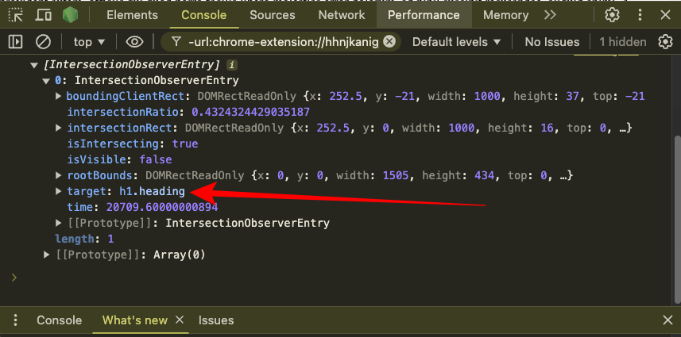

import NewsletterFrameInPost from '../../components/blog-post-components/NewsletterFrameInPost.astro';
import NoteAlertBox from '../../components/blog-post-components/NoteAlertBox.astro';
import TipAlertBox from '../../components/blog-post-components/TipAlertBox.astro';

In simple terms, the JavaScript intersection observer API is a tool that lets you know when an element on a webpage is visible on the screen.

The API makes it easy to detect when elements enter or leave the viewport, removing the need for complex scroll event handling. This allows developers to execute actions based on the visibility of elements within the viewport.

The said actions include lazy-loading images, implementing infinite scrolling, or triggering animations when elements become visible.

Keep reading as I walk you through the syntax of the Intersection Observer API and share three examples to help you start using it in your projects.

## Basic Syntax of the Intersection Observer API

Below is the basic syntax of the intersection observer API:

```js
const observerVariable = new IntersectionObserver(
  callbackFunc,
  observerOptions
);

observerVariable.observe(targetElement);
```

Let's look at each of the items in the syntax:

- `InterSectionObserver()` is the API itself. It's a constructor, so you need to initialize it with the `new` keyword. It takes two parameters – a callback function and an optional `options` object.
- `callbackFunc` is the callback function is the function that will be called whenever the observed element enters or exits the viewport
- `observerOptions` is an object that allows you to specify the root element for observing, margins around the root, and visibility thresholds to trigger the callback.
- `observerVariable` is the constant you have to assign the instance of the `IntersectionObserver` constructor to. It's an identifier (a name), so you can call it whatever you want.
- `observerVariable.observe(targetElement)` is the line that will finally do the slam dunk with the `observe()` method. The `targetElement` is the element you want to do something with.

<NoteAlertBox>
  The `root` is the area you’re watching, `rootMargin` adds extra space around
  that area, and `threshold` tells us how much of the element needs to be
  visible before we notice it and take action.
</NoteAlertBox>

Let's look at 3 examples of the ways you can use the intersection observer API:

- the first example will focus on observing a single element and using the basic syntax as is
- the second will observe one element too but make the syntax clearer
- the third will show you how to observe multiple elements without defining separate observers for them

## Example 1: Using the Intersection Observer API to Observe a Single Element

Let's observe the `h1` element in the HTML code below:

```html collapse={12-161}
<!DOCTYPE html>
<html lang="en">
  <head>
    <meta charset="UTF-8" />
    <meta name="viewport" content="width=device-width, initial-scale=1.0" />
    <title>JS Intersection Observer API</title>
    <link rel="stylesheet" href="styles.css" />
  </head>
  <body>
    <h1 class="heading">JavaScript Intersection Observer API</h1>

    <p>
      Lorem, ipsum dolor sit amet consectetur adipisicing elit. Dolore nihil
      veniam ipsa numquam totam eligendi eaque error eum, voluptates enim
      laudantium sapiente, hic unde inventore a dolorem adipisci consequuntur
      assumenda tempora nobis iste voluptate officiis nesciunt. Neque numquam
      iusto ipsum quos tempora delectus expedita autem eaque facere voluptate
      rerum ab possimus, explicabo quasi! Culpa asperiores temporibus dicta
      error est, consectetur exercitationem nihil optio voluptate pariatur.
      Voluptatem provident autem, officiis qui quod porro facilis libero
      molestias error dolorum, ad nihil suscipit recusandae, aliquid animi. A,
      temporibus? Optio fugit sed natus recusandae fugiat veniam illo hic
      aperiam officia inventore ea molestiae itaque qui, deleniti officiis?
      Aliquid fuga nisi veritatis commodi doloribus sit rerum alias adipisci
      natus. Incidunt totam reprehenderit atque deserunt veritatis iste
      perferendis tempora minima, commodi asperiores quae recusandae aliquam
      error quisquam ab eveniet quam provident, possimus natus, necessitatibus
      unde ratione.
    </p>
    <p>
      Lorem, ipsum dolor sit amet consectetur adipisicing elit. Dolore nihil
      veniam ipsa numquam totam eligendi eaque error eum, voluptates enim
      laudantium sapiente, hic unde inventore a dolorem adipisci consequuntur
      assumenda tempora nobis iste voluptate officiis nesciunt. Neque numquam
      iusto ipsum quos tempora delectus expedita autem eaque facere voluptate
      rerum ab possimus, explicabo quasi! Culpa asperiores temporibus dicta
      error est, consectetur exercitationem nihil optio voluptate pariatur.
      Voluptatem provident autem, officiis qui quod porro facilis libero
      molestias error dolorum, ad nihil suscipit recusandae, aliquid animi. A,
      temporibus? Optio fugit sed natus recusandae fugiat veniam illo hic
      aperiam officia inventore ea molestiae itaque qui, deleniti officiis?
      Aliquid fuga nisi veritatis commodi doloribus sit rerum alias adipisci
      natus. Incidunt totam reprehenderit atque deserunt veritatis iste
      perferendis tempora minima, commodi asperiores quae recusandae aliquam
      error quisquam ab eveniet quam provident, possimus natus, necessitatibus
      unde ratione.
    </p>
    <p>
      Lorem, ipsum dolor sit amet consectetur adipisicing elit. Dolore nihil
      veniam ipsa numquam totam eligendi eaque error eum, voluptates enim
      laudantium sapiente, hic unde inventore a dolorem adipisci consequuntur
      assumenda tempora nobis iste voluptate officiis nesciunt. Neque numquam
      iusto ipsum quos tempora delectus expedita autem eaque facere voluptate
      rerum ab possimus, explicabo quasi! Culpa asperiores temporibus dicta
      error est, consectetur exercitationem nihil optio voluptate pariatur.
      Voluptatem provident autem, officiis qui quod porro facilis libero
      molestias error dolorum, ad nihil suscipit recusandae, aliquid animi. A,
      temporibus? Optio fugit sed natus recusandae fugiat veniam illo hic
      aperiam officia inventore ea molestiae itaque qui, deleniti officiis?
      Aliquid fuga nisi veritatis commodi doloribus sit rerum alias adipisci
      natus. Incidunt totam reprehenderit atque deserunt veritatis iste
      perferendis tempora minima, commodi asperiores quae recusandae aliquam
      error quisquam ab eveniet quam provident, possimus natus, necessitatibus
      unde ratione.
    </p>
    <p>
      Lorem, ipsum dolor sit amet consectetur adipisicing elit. Dolore nihil
      veniam ipsa numquam totam eligendi eaque error eum, voluptates enim
      laudantium sapiente, hic unde inventore a dolorem adipisci consequuntur
      assumenda tempora nobis iste voluptate officiis nesciunt. Neque numquam
      iusto ipsum quos tempora delectus expedita autem eaque facere voluptate
      rerum ab possimus, explicabo quasi! Culpa asperiores temporibus dicta
      error est, consectetur exercitationem nihil optio voluptate pariatur.
      Voluptatem provident autem, officiis qui quod porro facilis libero
      molestias error dolorum, ad nihil suscipit recusandae, aliquid animi. A,
      temporibus? Optio fugit sed natus recusandae fugiat veniam illo hic
      aperiam officia inventore ea molestiae itaque qui, deleniti officiis?
      Aliquid fuga nisi veritatis commodi doloribus sit rerum alias adipisci
      natus. Incidunt totam reprehenderit atque deserunt veritatis iste
      perferendis tempora minima, commodi asperiores quae recusandae aliquam
      error quisquam ab eveniet quam provident, possimus natus, necessitatibus
      unde ratione.
    </p>
    <p>
      Lorem, ipsum dolor sit amet consectetur adipisicing elit. Dolore nihil
      veniam ipsa numquam totam eligendi eaque error eum, voluptates enim
      laudantium sapiente, hic unde inventore a dolorem adipisci consequuntur
      assumenda tempora nobis iste voluptate officiis nesciunt. Neque numquam
      iusto ipsum quos tempora delectus expedita autem eaque facere voluptate
      rerum ab possimus, explicabo quasi! Culpa asperiores temporibus dicta
      error est, consectetur exercitationem nihil optio voluptate pariatur.
      Voluptatem provident autem, officiis qui quod porro facilis libero
      molestias error dolorum, ad nihil suscipit recusandae, aliquid animi. A,
      temporibus? Optio fugit sed natus recusandae fugiat veniam illo hic
      aperiam officia inventore ea molestiae itaque qui, deleniti officiis?
      Aliquid fuga nisi veritatis commodi doloribus sit rerum alias adipisci
      natus. Incidunt totam reprehenderit atque deserunt veritatis iste
      perferendis tempora minima, commodi asperiores quae recusandae aliquam
      error quisquam ab eveniet quam provident, possimus natus, necessitatibus
      unde ratione.
    </p>

    <div class="box"></div>

    <p>
      Lorem, ipsum dolor sit amet consectetur adipisicing elit. Dolore nihil
      veniam ipsa numquam totam eligendi eaque error eum, voluptates enim
      laudantium sapiente, hic unde inventore a dolorem adipisci consequuntur
      assumenda tempora nobis iste voluptate officiis nesciunt. Neque numquam
      iusto ipsum quos tempora delectus expedita autem eaque facere voluptate
      rerum ab possimus, explicabo quasi! Culpa asperiores temporibus dicta
      error est, consectetur exercitationem nihil optio voluptate pariatur.
      Voluptatem provident autem, officiis qui quod porro facilis libero
      molestias error dolorum, ad nihil suscipit recusandae, aliquid animi. A,
      temporibus? Optio fugit sed natus recusandae fugiat veniam illo hic
      aperiam officia inventore ea molestiae itaque qui, deleniti officiis?
      Aliquid fuga nisi veritatis commodi doloribus sit rerum alias adipisci
      natus. Incidunt totam reprehenderit atque deserunt veritatis iste
      perferendis tempora minima, commodi asperiores quae recusandae aliquam
      error quisquam ab eveniet quam provident, possimus natus, necessitatibus
      unde ratione.
    </p>

    <p>
      Lorem, ipsum dolor sit amet consectetur adipisicing elit. Dolore nihil
      veniam ipsa numquam totam eligendi eaque error eum, voluptates enim
      laudantium sapiente, hic unde inventore a dolorem adipisci consequuntur
      assumenda tempora nobis iste voluptate officiis nesciunt. Neque numquam
      iusto ipsum quos tempora delectus expedita autem eaque facere voluptate
      rerum ab possimus, explicabo quasi! Culpa asperiores temporibus dicta
      error est, consectetur exercitationem nihil optio voluptate pariatur.
      Voluptatem provident autem, officiis qui quod porro facilis libero
      molestias error dolorum, ad nihil suscipit recusandae, aliquid animi. A,
      temporibus? Optio fugit sed natus recusandae fugiat veniam illo hic
      aperiam officia inventore ea molestiae itaque qui, deleniti officiis?
      Aliquid fuga nisi veritatis commodi doloribus sit rerum alias adipisci
      natus. Incidunt totam reprehenderit atque deserunt veritatis iste
      perferendis tempora minima, commodi asperiores quae recusandae aliquam
      error quisquam ab eveniet quam provident, possimus natus, necessitatibus
      unde ratione.
    </p>

    <p>
      Lorem, ipsum dolor sit amet consectetur adipisicing elit. Dolore nihil
      veniam ipsa numquam totam eligendi eaque error eum, voluptates enim
      laudantium sapiente, hic unde inventore a dolorem adipisci consequuntur
      assumenda tempora nobis iste voluptate officiis nesciunt. Neque numquam
      iusto ipsum quos tempora delectus expedita autem eaque facere voluptate
      rerum ab possimus, explicabo quasi! Culpa asperiores temporibus dicta
      error est, consectetur exercitationem nihil optio voluptate pariatur.
      Voluptatem provident autem, officiis qui quod porro facilis libero
      molestias error dolorum, ad nihil suscipit recusandae, aliquid animi. A,
      temporibus? Optio fugit sed natus recusandae fugiat veniam illo hic
      aperiam officia inventore ea molestiae itaque qui, deleniti officiis?
      Aliquid fuga nisi veritatis commodi doloribus sit rerum alias adipisci
      natus. Incidunt totam reprehenderit atque deserunt veritatis iste
      perferendis tempora minima, commodi asperiores quae recusandae aliquam
      error quisquam ab eveniet quam provident, possimus natus, necessitatibus
      unde ratione.
    </p>

    <p>
      Lorem, ipsum dolor sit amet consectetur adipisicing elit. Dolore nihil
      veniam ipsa numquam totam eligendi eaque error eum, voluptates enim
      laudantium sapiente, hic unde inventore a dolorem adipisci consequuntur
      assumenda tempora nobis iste voluptate officiis nesciunt. Neque numquam
      iusto ipsum quos tempora delectus expedita autem eaque facere voluptate
      rerum ab possimus, explicabo quasi! Culpa asperiores temporibus dicta
      error est, consectetur exercitationem nihil optio voluptate pariatur.
      Voluptatem provident autem, officiis qui quod porro facilis libero
      molestias error dolorum, ad nihil suscipit recusandae, aliquid animi. A,
      temporibus? Optio fugit sed natus recusandae fugiat veniam illo hic
      aperiam officia inventore ea molestiae itaque qui, deleniti officiis?
      Aliquid fuga nisi veritatis commodi doloribus sit rerum alias adipisci
      natus. Incidunt totam reprehenderit atque deserunt veritatis iste
      perferendis tempora minima, commodi asperiores quae recusandae aliquam
      error quisquam ab eveniet quam provident, possimus natus, necessitatibus
      unde ratione.
    </p>

    <div class="circle"></div>

    <script src="script.js"></script>
  </body>
</html>
```

Here's the CSS for the HTML:

```css collapse={16-41}
* {
  margin: 0;
  padding: 0;
  box-sizing: border-box;
}

body {
  max-width: 1000px;
  margin: 0 auto;
  transition: 2s ease-in-out;
}

h1 {
  margin: 1rem 0;
}

p {
  margin: 4rem 0;
  line-height: 1.5;
}

@keyframes rotate {
  from {
    transform: rotate(0deg);
  }
  to {
    transform: rotate(360deg);
  }
}

.animate {
  animation: rotate 2s linear infinite;
}

.box {
  height: 400px;
  width: 400px;
  background-color: #2ecc71;
  transition: background-color 0.3s;
}

.circle {
  height: 400px;
  width: 400px;
  background-color: #2ecc71;
  border-radius: 49%;
}
```

<TipAlertBox>
  The two snippets will be used for the remaining examples. So you should expand
  them and study them.
</TipAlertBox>

To start observing the `h1` element, you need to reference it with `querySelector` [or your favourite method of doing so].

I'll do that by targeting the `.heading` class of the `h1`:

```js
const h1 = document.querySelector('.heading');
```

The next thing to do is to create a new instance of the intersection observer API and pass in the callback and the options.

I'll start by defining an `observerh1` variable set to a new instance of `IntersectionObserver()`. I will also start observing the `h1` element straight away:

```js
const observeh1 = new IntersectionObserver();

observeh1.observe(h1);
```

For the callback, I'm going to start with an `entries` parameter for an arrow function, I'll also log the entries parameter to the console:

```js
const observeh1 = new IntersectionObserver((entries) => {
  console.log(entries);
});
```



You can see that the target is indeed the `h1` element with the class `heading`.

There's also an `isIntersecting` property you can use to check if the target element is in the viewport.

Let's loop through the entries (only `h1` for now, actually) and do something using the `isIntersecting` property based on whether the `h1` is in the viewport or not:

```js
const observeh1 = new IntersectionObserver((entries) => {
  entries.forEach((entry) => {
    if (entry.isIntersecting) {
      console.log('h1 is in the viewport!');
    } else {
      console.log('h1 is out of the viewport!');
    }
  });
});

observeh1.observe(h1);
```

Here's the result:


Isn't that what we all call "cool"?

You can take things further and assign some style to the target element once it's in the viewport:

```js
const observeh1 = new IntersectionObserver((entries) => {
  entries.forEach((entry) => {
    if (entry.isIntersecting) {
      console.log('h1 is in the viewport!');
      entry.target.style.backgroundColor = '#3498db';
      entry.target.style.fontSize = '4rem';
    } else {
      console.log('h1 is out of the viewport!');
      entry.target.style.backgroundColor = 'unset';
      entry.target.style.fontSize = 'unset';
    }
  });
});
```

For the optional options object, I'll pass in the following:

```js
const observeh1 = new IntersectionObserver(
  (entries) => {
    entries.forEach((entry) => {
      if (entry.isIntersecting) {
        console.log('h1 is in the viewport!');
        entry.target.style.backgroundColor = '#3498db';
        entry.target.style.fontSize = '4rem';
      } else {
        console.log('h1 is out of the viewport!');
        entry.target.style.backgroundColor = '#2ecc71';
        entry.target.style.fontSize = 'unset';
      }
    });
  },
  {
    root: null,
    rootMargin: '200px',
    threshold: 0.5,
  }
);

observeh1.observe(h1);
```

Don't be confused. Here's what those mean:

- a `root` of `null` means the observer will use the entire browser viewport as the area to watch for visibility changes
- a `rootMargin` of `200px` means the observer will add an extra `200px` around the root area (the entire browser viewport for this example) , so elements will be considered visible even when they are still 200 pixels outside the root
- a `threshold` of `0.5` means 50% of the element needs to be visible before the observer callback will be triggered

This is what things look like now:


In case you're doubting it, things really do change if you inspect the `h1` element:


## Example 2: Defining the Callback and Options Outside of the `IntersectionObserver` Constructor

You don't have to fill up the `IntersectionObserver` constructor with the callback function and options parameters. You can define both outside and reference them inside the constructor.

To show you how to do this, let's observe the box inside the HTML code. Here's the fully commented code that shows you what's going on:

```js
const box = document.querySelector('.box');

// Define the callback function outside the constructor
const observerCallback = (entries) => {
  entries.forEach((entry) => {
    if (entry.isIntersecting) {
      // Once the box is within the viewport:

      // 1. Log "Box is in the viewport!" to the console
      console.log('Box is in the viewport!');
      // 2. Change the background color to blue
      entry.target.style.backgroundColor = '#3498db';
      // 3. Add a class that animates the box
      entry.target.classList.add('animate');
    } else {
      // Once the box is outside the viewport:

      // 1. Log "Box is out of the viewport!" to the console
      console.log('Box is out of the viewport!');
      // 2. Change the background color to green
      entry.target.style.backgroundColor = '#2ecc71';
      // 3. Remove the class that animates the box
      entry.target.classList.remove('animate');
    }
  });
};

// Define the options
const observerOptions = {
  root: null,
  rootMargin: '0px',
  threshold: 0.5,
};

// Define the constructor and reference the callback function and the options
const observer = new IntersectionObserver(observerCallback, observerOptions);

// Observe the box
observer.observe(box);
```

Here's what's happening to the box now:


Pardon the interruption

<NewsletterFrameInPost />

Back to the intersection observer API

## Example 3: How to Observe Multiple Elements with the IntersectionObserver API

Observing multiple element with the `IntersectionObserver` API works a bit differently.

To do that, you need to do these:

- select your elements from the HTML with `querySelectorAll()` or other relevant methods
- define your callback and options as usual
- supply the callback and the options parameters into the `IntersectionObserver` API constructor
- loop through the target elements with `forEach` and observe them inside it

Here's how I was able to observe the circle and box on the page:

```js
// select the target box and the circle with querySelectorAll()
const targets = document.querySelectorAll('.box, .circle');

//define the callback function
const observerCallback = (entries) => {
  entries.forEach((entry) => {
    // Once the targets are within the viewport:
    if (entry.isIntersecting) {
      // 1. Log "[target] is in the viewport" to the console
      console.log(`${entry.target.className} is in the viewport!`);
      // 2. Add a blue background color to the targets
      entry.target.style.backgroundColor = '#3498db';
      // 3. Animate the target
      entry.target.classList.add('animate');
    } else {
      // Once the targets are out of the viewport:

      // 1. Log "[target] is out of the viewport" to the console
      console.log(`${entry.target.className} is out of the viewport!`);
      // 2. Add a green background color to the targets
      entry.target.style.backgroundColor = '#2ecc71';
      // 3. Remove the animation from the target
      entry.target.classList.remove('animate');
    }
  });
};

// define the options
const observerOptions = {
  root: null,
  rootMargin: '0px',
  threshold: 0.5,
};

// pass the callback and options into the constructor
const observer = new IntersectionObserver(observerCallback, observerOptions);

// loop through the selected targets and observe them
targets.forEach((target) => observer.observe(target));
```

Here are the box and the circle intersecting:


You can see that in the second and third examples, the animation is only triggered once the user scrolls to them. This can be useful when you're dealing with expensive animations or other processes.

The Intersection Observer API improves user experience by ensuring elements load and animate only when needed, reducing unnecessary processing and enhancing performance. It's an excellent tool for creating responsive, efficient, and engaging web interactions.

Start using the `IntersectionObserver` API in your projects now!
