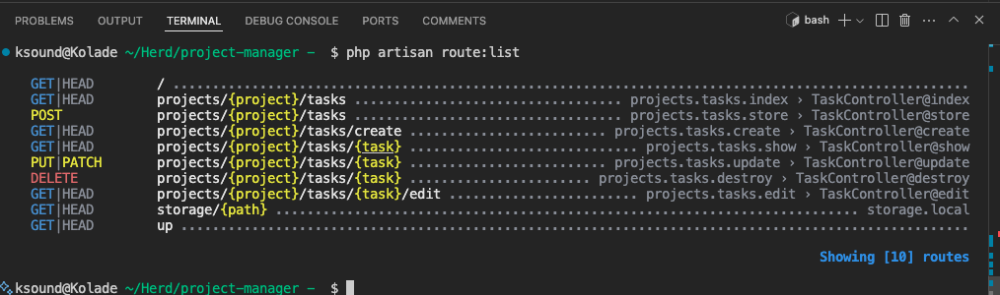
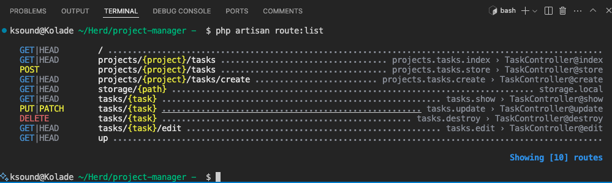
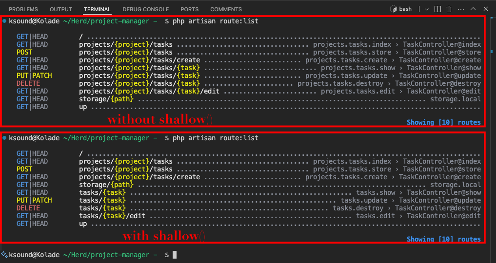

Often, nested routes get messy in Laravel applications. But Laravel has an answer for many of its problems, that's why they introduced the `shallow()` function to help you manage nested routes more succinctly.

In this article, you will learn what the `shallow()` function is and how it makes your routes cleaner and easier to manage.

## What is the Laravel `shallow()` Function?

In Laravel, the `shallow()` lets you define nested resource routes to reduce unnecessary repetition of parent resource identifiers in the URL. It creates a "shallow" version of nested routes, which ensures that only certain actions require the parent resource ID, while others use only the child resource unique ID.

Don't get that yet?

Imagine you have a parent resource, say `post` and a child resource, say `comments` nested under it. By default, all child routes will include both the parent and child IDs, for example, `/posts/{post}/comments/{comment}`. Of if you're working with project management routes, `/projects/{project}/tasks/{task}`.

That's some repetition you can avoid!

To avoid that repetition, you can attach the `shallow()` function to that route to do two things:

- keep the parent ID only for routes that need it, like creating a post, or a comment for a project and creating project, or tasks for a project
- remove the parent ID for routes that don't need it, like editing or deleting a task

## How the Laravel `shallow()` Function Works

To use the `shallow()` method, you apply it to your nested route this way:

```php
Route::resource('projects.tasks', TaskController::class)->shallow();
```

When you do that, Laravel splits the nested routes into two groups for you:

- parent + child routes for actions that depend on the parent route like:

  - `GET /projects/{project}/tasks` to list the tasks in a project
  - `GET /projects/{project}/tasks/create` to show the form for creating a task for a project
  - `POST /projects/{project}/tasks` to create a task for a project

- child-only routes for actions that only need the child like:
  - `GET /tasks/{task}` to show a task
  - `GET /tasks/{task}/edit` to show the edit form for a task
  - `PUT/PATCH /tasks/{task}` to update a task
  - `DELETE /tasks/{task}` to delete a task

To put all that into an actual practice, I have a `Project` model and a `Task` model. The `Project` model has a one-to-many relationship with `Task`:

```php
public function tasks()
   {
      return $this->hasMany(Task::class);
   }
```

And `Task` has a `belongsTo` relationship with `Project`:

```php
public function project()
{
    return $this->belongsTo(Project::class);
}
```

So, it makes sense to have this kind of route in my `routes/web.php` file:

```php
Route::resource('projects.tasks', TaskController::class);
```

With this route, here's what I get when I run `php artisan route:list` to see the routes I have in the project:



You can see I have long routes like these:

```bash
DELETE          projects/{project}/tasks/{task}
PUT|PATCH       projects/{project}/tasks/{task}
```

To avoid that, I will add the `shallow()` function to the route this way:

```php
Route::resource('projects.tasks', TaskController::class)->shallow();
```

Now this is what my routes look like:



You can see the tasks only route that don't need the parent have become more concise with `project` gone from them.

Here's the screenshot again with the two kind of routes:



Thank you for reading!
