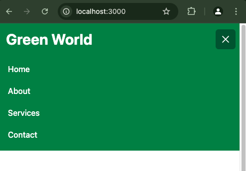

import NoteAlertBox from '../../components/blog-post-components/NoteAlertBox.astro';
import NewsletterFrameInPost from '../../components/blog-post-components/NewsletterFrameInPost.astro';

Creating a user-friendly navigation system is essential for any website, and highlighting the current page link in the navbar is an integral aspect of that.

In Next.js, a popular React framework, implementing this feature can improve user experience by visually indicating the current page or section the user is visiting. This not only guides users through your site content, it also adds a touch of elegance to the website design.

There are many ways you can highlight the active navlink in Next.jsand React. The popular way of doing it with React is using the `react-router` package. In Next JS, we used to do it with the `userRouter` hook.

This article will take you through the new Next JS way of highlighting the active navlink, particularly in Next 14, and that's using the `usePathname` hook.

<NoteAlertBox>
  You can't use the `useRouter` hook for styling the active navlink anymore
  because the `pathname` string has been replaced by a `usePathname()` hook you
  must import from `next/navigation`. The `useRouter` itself is also now to be
  imported from `next/navigation`.
</NoteAlertBox>

## The Navbar we are Working with

The navbar we are using for this guide has already been prepared for you with Tailwind CSS. You can expand the code to see it in full.

```js collapse={8-140}
'use client';
import { useState } from 'react';
import Link from 'next/link';

const Navbar = () => {
  const [isOpen, setIsOpen] = useState(false);

  const toggleMenu = () => {
    setIsOpen(!isOpen);
  };

  const handleClick = () => {
    setIsOpen(false);
  };

  return (
    <nav className="bg-green-700">
      <div className="max-w-7xl mx-auto px-4 sm:px-6 lg:px-8 lg:py-3">
        <div className="flex items-center justify-between h-16">
          <div className="flex-shrink-0">
            <Link href="/">
              <span className="text-white font-bold text-3xl">Green World</span>
            </Link>
          </div>
          <div className="hidden md:flex">
            <div className="flex items-baseline space-x-4 w-full justify-between">
              <Link
                href="/"
                className="
                 text-white hover:bg-green-900 hover:text-gray-100 px-3 py-2
                 rounded-md text-2xl font-medium"
              >
                Home
              </Link>
              <Link
                href="/about"
                className="
                text-white hover:bg-green-900 hover:text-gray-100 px-3 py-2 rounded-md
                text-2xl font-medium"
              >
                About
              </Link>
              <Link
                href="/services"
                className="
                text-white hover:bg-green-900 hover:text-gray-100 px-3 py-2 rounded-md
                text-2xl font-medium"
              >
                Services
              </Link>
              <Link
                href="/contact"
                className="
                 text-white hover:bg-green-900 hover:text-gray-100 px-3 py-2 rounded-md
                 text-2xl font-medium"
              >
                Contact
              </Link>
            </div>
          </div>
          <div className="-mr-2 flex md:hidden">
            <button
              type="button"
              className="inline-flex items-center justify-center p-2 rounded-md text-white
              hover:text-gray-100 hover:bg-green-900 focus:outline-none
              focus:bg-green-900 focus:text-white transition duration-150 ease-in-out"
              onClick={toggleMenu}
              aria-label="Main menu"
              aria-expanded={isOpen}
            >
              <svg
                className="block h-6 w-6"
                stroke="currentColor"
                fill="none"
                viewBox="0 0 24 24"
              >
                {isOpen ? (
                  <path
                    strokeLinecap="round"
                    strokeLinejoin="round"
                    strokeWidth="2"
                    d="M6 18L18 6M6 6l12 12"
                  />
                ) : (
                  <path
                    strokeLinecap="round"
                    strokeLinejoin="round"
                    strokeWidth="2"
                    d="M4 6h16M4 12h16M4 18h16"
                  />
                )}
              </svg>
            </button>
          </div>
        </div>
      </div>

      {/* Mobile menu */}
      <div className={`${isOpen ? 'block' : 'hidden'} md:hidden `}>
        <div
          className={`${
            isOpen ? 'translate-x-0 opacity-100' : 'translate-x-full opacity-0'
          } px-2 pt-2 pb-3 space-y-1 sm:px-3 `}
        >
          <Link
            href="/"
            className=" text-white hover:bg-green-900 hover:text-gray-100 block
            px-3 py-2 rounded-md text-base font-medium"
            onClick={handleClick}
          >
            Home
          </Link>
          <Link
            href="/about"
            className="text-white hover:bg-green-900 hover:text-gray-100 block
            px-3 py-2 rounded-md text-base font-medium"
            onClick={handleClick}
          >
            About
          </Link>
          <Link
            href="/services"
            className="text-white hover:bg-green-900 hover:text-gray-100
            block px-3 py-2 rounded-md text-base font-medium"
            onClick={handleClick}
          >
            Services
          </Link>
          <Link
            href="/contact"
            className=" text-white hover:bg-green-900 hover:text-gray-100
            block px-3 py-2 rounded-md text-base  font-medium"
            onClick={handleClick}
          >
            Contact
          </Link>
        </div>
      </div>
    </nav>
  );
};

export default Navbar;
```

What's the code above doing?

- the `use-client` directive signifies to React that the component is a client component
- `useState` is imported from React and `Link` from next link
- an `isOpen` state variable is set and `setIsOpen` to modify the state
- a `toggleMenu` function is created to handle the opening and closing of the mobile menu
- an `handleClick` function is created to hide and show the nav items when one of them is selected on the mobile menu

This is what the navbar looks like on a desktop screen:


And this is what it looks like on a mobile screen:



## How to Use the `usePathname` Hook to Highlight the Current Page Link

### Step 1: Create a new Next JS app with the command below

```bash
npx create-next-app@latest # if you're using NPM
yarn create next-app # if you're using Yarn
pnpm create next-app # if you're using PNPM
```

### Step 2: Create a `Navbar.jsx` component in the root and import the `usePathname` hook from `next/navigation`

```js ins={5}
'use client';
import { useState } from 'react';

import Link from 'next/link';
import { usePathname } from 'next/navigation';

const Navbar = () => {
  const [isOpen, setIsOpen] = useState(false);

  const toggleMenu = () => {
    setIsOpen(!isOpen);
  };

  const handleClick = () => {
    setIsOpen(false);
  };

  return (
    <nav className="bg-green-700">{/* Rest of desktop and mobile menu */}</nav>
  );
};

export default Navbar;
```

### Step 3: Then you must initialize the `usePathname` hook

```js ins={18}
'use client';
import { useState } from 'react';

import Link from 'next/link';
import { usePathname } from 'next/navigation';

const Navbar = () => {
  const [isOpen, setIsOpen] = useState(false);

  const toggleMenu = () => {
    setIsOpen(!isOpen);
  };

  const handleClick = () => {
    setIsOpen(false);
  };

  const pathname = usePathname();

  return (
    <nav className="bg-green-700">{/* Rest of desktop and mobile menu */}</nav>
  );
};

export default Navbar;
```

### Step 4: After that, you have to make the `className` of each navlink dynamic with the syntax below

```js
className={`${pathname === '/pageFolderName ? 'bg-green-900' : ''}
text-white hover:bg-green-900 hover:text-gray-100 px-3 py-2 rounded-md text-2xl font-medium`}
```

For example, the entire `services` page link and text will now look like this:

```js
<Link
  href="/services"
  className={`${
    pathname === '/services' ? 'bg-green-900' : ''
  } text-white hover:bg-green-900 hover:text-gray-100 px-3 py-2 rounded-md text-2xl font-medium`}
>
  Services
</Link>
```

And those of the `about` page will look like this:

```js
<Link
  href="/about"
  className={`${
    pathname === '/about' ? 'bg-green-900' : ''
  } text-white hover:bg-green-900 hover:text-gray-100 px-3 py-2 rounded-md text-2xl font-medium`}
>
  About
</Link>
```

You must also make the `classNames` of the mobile items dynamic.
For example, this is what the `about` page item of the mobile menu will look like:

```js
<Link
  href="/about"
  className={`${
    pathname === '/about' ? 'bg-green-900' : ''
  } text-white hover:bg-green-900 hover:text-gray-100 block px-3 py-2
  rounded-md text-base  font-medium`}
  onClick={handleClick}
>
  About
</Link>
```

After making all the necessary changes, the entire `Navbar` component should be this:

```js collapse={8-140}
'use client';
import { useState } from 'react';

import Link from 'next/link';
import { usePathname } from 'next/navigation';

const Navbar = () => {
  const [isOpen, setIsOpen] = useState(false);

  const toggleMenu = () => {
    setIsOpen(!isOpen);
  };

  const handleClick = () => {
    setIsOpen(false);
  };

  const pathname = usePathname();

  return (
    <nav className="bg-green-700">
      <div className="max-w-7xl mx-auto px-4 sm:px-6 lg:px-8 lg:py-3">
        <div className="flex items-center justify-between h-16">
          <div className="flex-shrink-0">
            <Link href="/">
              <span className="text-white font-bold text-3xl">Green World</span>
            </Link>
          </div>
          <div className="hidden md:flex">
            <div className="flex items-baseline space-x-4 w-full justify-between">
              <Link
                href="/"
                className={`${
                  pathname === '/' ? 'bg-green-900' : ''
                } text-white hover:bg-green-900 hover:text-gray-100 px-3 py-2
                rounded-md text-2xl font-medium`}
              >
                Home
              </Link>
              <Link
                href="/about"
                className={`${
                  pathname === '/about' ? 'bg-green-900' : ''
                } text-white hover:bg-green-900 hover:text-gray-100 px-3 py-2
                rounded-md text-2xl font-medium`}
              >
                About
              </Link>
              <Link
                href="/services"
                className={`${
                  pathname === '/services' ? 'bg-green-900' : ''
                } text-white hover:bg-green-900 hover:text-gray-100 px-3 py-2
                rounded-md text-2xl font-medium`}
              >
                Services
              </Link>
              <Link
                href="/contact"
                className={`${
                  pathname === '/contact' ? 'bg-green-900' : ''
                } text-white hover:bg-green-900 hover:text-gray-100 px-3 py-2
                rounded-md text-2xl font-medium`}
              >
                Contact
              </Link>
            </div>
          </div>
          <div className="-mr-2 flex md:hidden">
            <button
              type="button"
              className="inline-flex items-center justify-center
              p-2 rounded-md text-white hover:text-gray-100 hover:bg-green-900
              focus:outline-none focus:bg-green-900 focus:text-white transition duration-150
              ease-in-out"
              onClick={toggleMenu}
              aria-label="Main menu"
              aria-expanded={isOpen}
            >
              <svg
                className="block h-6 w-6"
                stroke="currentColor"
                fill="none"
                viewBox="0 0 24 24"
              >
                {isOpen ? (
                  <path
                    strokeLinecap="round"
                    strokeLinejoin="round"
                    strokeWidth="2"
                    d="M6 18L18 6M6 6l12 12"
                  />
                ) : (
                  <path
                    strokeLinecap="round"
                    strokeLinejoin="round"
                    strokeWidth="2"
                    d="M4 6h16M4 12h16M4 18h16"
                  />
                )}
              </svg>
            </button>
          </div>
        </div>
      </div>

      {/* Mobile menu */}
      <div className={`${isOpen ? 'block' : 'hidden'} md:hidden `}>
        <div
          className={`${
            isOpen ? 'translate-x-0 opacity-100' : 'translate-x-full opacity-0'
          } px-2 pt-2 pb-3 space-y-1 sm:px-3 `}
        >
          <Link
            href="/"
            className={`${
              pathname === '/' ? 'bg-green-900' : ''
            } text-white hover:bg-green-900 hover:text-gray-100 block px-3 py-2
            rounded-md text-base  font-medium`}
            onClick={handleClick}
          >
            Home
          </Link>
          <Link
            href="/about"
            className={`${
              pathname === '/about' ? 'bg-green-900' : ''
            } text-white hover:bg-green-900 hover:text-gray-100 block px-3 py-2 
            rounded-md text-base  font-medium`}
            onClick={handleClick}
          >
            About
          </Link>
          <Link
            href="/services"
            className={`${
              pathname === '/services' ? 'bg-green-900' : ''
            } text-white hover:bg-green-900 hover:text-gray-100
            block px-3 py-2 rounded-md text-base  font-medium`}
            onClick={handleClick}
          >
            Services
          </Link>
          <Link
            href="/contact"
            className={`${
              pathname === '/contact' ? 'bg-green-900' : ''
            } text-white hover:bg-green-900 hover:text-gray-100
            block px-3 py-2 rounded-md text-base  font-medium`}
            onClick={handleClick}
          >
            Contact
          </Link>
        </div>
      </div>
    </nav>
  );
};

export default Navbar;
```

Don't forget to expand the code so you can see the changes I made.

### Step 5: You then need to import the `Navbar` component into your `layout` file and use it.

```js ins={2, 14}
import '@/assets/styles/globals.css';
import Navbar from '@/components/Navbar';

export const metadata = {
  title: 'Green World | Home of Nature Scenes',
  description: 'Find the coolest nature images and videos',
  keywords: 'nature animals trees fields',
};

const MainLayout = ({ children }: React.PropsWithChildren<{}>) => {
  return (
    <html>
      <body>
        <Navbar />
        <main>{children}</main>
      </body>
    </html>
  );
};

export default MainLayout;
```

<NoteAlertBox>
  The layout file should be in the app directory if you're using the Next 14 app
  router
</NoteAlertBox>

The navbar should now look like this on a desktop screen:


And it should look like this on a mobile screen:


If you're wondering how I got an item to show for each page, I created each page in the `app` directory. This is what the folder structure looks like:


## Wrapping Up

Highlighting the current page link in the navbar is one of the many critical features you should consider implementing if you have user experience in mind.

This feature not only enhances the user experience, it also strengthens visual design and sends to the user a good perception of your website.

To better understand things, you can grab the code for this article from [the project GitHub repo](https://github.com/Ksound22/next-active-link-next-layout-demo).
