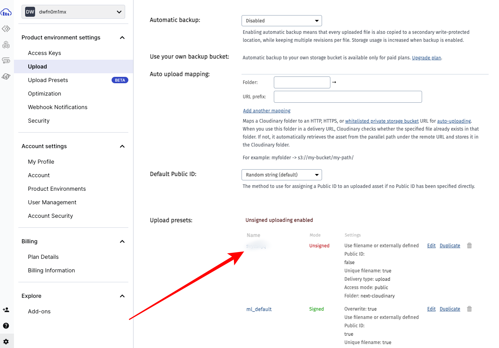

import NewsletterFrameInPost from '../../components/blog-post-components/NewsletterFrameInPost.astro';

Integrating Cloudinary with your Next JS project simplifies image uploads by removing concerns about storage space and application size, streamlining asset management on your website in the process.

When you use Cloudinary, you can effectively handle image uploads and organize your media in the cloud. This setup boosts media management capabilities, as you can also crop, resize, and format images easily.

This guide will walk you through the steps to fully integrate Cloudinary into a Next JS application. You'll learn how to upload images directly to Cloudinary and retrieve them for display in your Next JS projects.

## How to Integrate Cloudinary with Your Next JS Project

### Step 1: Create a Next JS Project with your Favourite Package Manager

```bash
npx create-next-app@latest # if you're using NPM
yarn create next-app # if you're using Yarn
pnpm create next-app # if you're using PNPM
```

For this demo, I have made the following choices in the prompts:


### Step 2: Install the Next Cloudinary NPM Package and Cloudinary

```bash
npm install next-cloudinary cloudinary
```

We'll use one of the components provided by the Next Cloudinary NPM package to display an upload button and the Cloudinary package to fetch the images after they're uploaded.

### Step 3: Get your Cloudinary Credentials and Save them in a `.env` File

You need the following credentials to be able to upload images and fetch images:

- cloudinary cloud name
- cloudinary API key
- cloudinary API secret
- cloudinary cloud preset name

To get the first three credentials in the list above, log in to your Cloudinary account and click "Programmable media" icon on the top-left corner. You'll see them under "Product Environment Credentials".


Copy the three credentials and save them in a `.env` file like this:

```bash
NEXT_PUBLIC_CLOUDINARY_CLOUD_NAME=
NEXT_PUBLIC_CLOUDINARY_API_KEY=
NEXT_PUBLIC_CLOUDINARY_API_SECRET=
```

You also need the cloud preset name so you can use any of the components available in the Next Cloudinary NPM package.

To get it, click on the gear icon in the bottom-left corner and select "Upload":


Click the red link with the text "Enable unsigned uploading":


After that, you will see an upload preset name. Copy it and save it as the value of a `NEXT_PUBLIC_CLOUDINARY_PRESET_NAME` in your `.env` file:



The environment variables in your `.env` file should now look like this:

```bash ins={1}
NEXT_PUBLIC_CLOUDINARY_CLOUD_NAME=value
NEXT_PUBLIC_CLOUDINARY_PRESET_NAME=value
NEXT_PUBLIC_CLOUDINARY_API_KEY=value
NEXT_PUBLIC_CLOUDINARY_API_SECRET=value
```

### Step 4: Add Cloudinary Domain to your `next.config.mjs` File

You must add the Cloudinary image domain, `res.cloudinary.com` to the `images.remotePatterns` array in your Next config file for the images to work.

Your `next.config.mjs` file should look like this after adding it:

```js
/** @type {import('next').NextConfig} */
const nextConfig = {
  images: {
    remotePatterns: [
      {
        protocol: 'https',
        hostname: 'res.cloudinary.com',
      },
    ],
  },
};

export default nextConfig;
```

### Step 5: Use the Next Cloudinary Built-in Component in your Components

The Next Cloudinary package has built-in components with which you can add a ready-made upload widget or button to your components. The one I chose is `CldUploadButton`.

Create a components folder in the root and a `CloudinaryUploader.jsx` client component file inside it.

Inside the file, import the `CldUploadButton` component, use it in the return statement, and create a `span` element with the text `Upload Image`:

```js
'use client';
import { CldUploadButton } from 'next-cloudinary';

const CloudinaryUploader = () => {
  return (
    <div>
      <CldUploadButton>
        <span>Upload Image</span>
      </CldUploadButton>
    </div>
  );
};

export default CloudinaryUploader;
```

You need to pass the `options` and `uploadPreset` properties into the component. The value for the `options` should be `{ multiple: true }` to allow multiple image upload, and that of the `uploadPreset` should be the cloud preset name from your `.env` file:

```js ins={10, 11}
'use client';
import { CldUploadButton } from 'next-cloudinary';

const cloudPresetName = process.env.NEXT_PUBLIC_CLOUDINARY_PRESET_NAME;

const CloudinaryUploader = () => {
  return (
    <div>
      <CldUploadButton
        options={{ multiple: true }}
        uploadPreset={cloudPresetName}
      >
        <span>Upload Image</span>
      </CldUploadButton>
    </div>
  );
};

export default CloudinaryUploader;
```

Clear everything inside the `page.jsx` file in the `app` folder and create an `h1` tag with the text `Next JS Cloudinary Integration`, then import the `CloudinaryUploader` component and use it in the return statement

```js
import CloudinaryUploader from '@/components/CloudinaryUploader';

function Home() {
  return (
    <main>
      <h1 className=" text-5xl text-center mt-4">
        Next JS Cloudinary Integration
      </h1>

      <CloudinaryUploader />
    </main>
  );
}

export default Home;
```

At this point, the button looks like this:


I will add some Tailwind classes to make the button and its text look better:

```js ins={13, 14}
'use client';

import { CldUploadButton } from 'next-cloudinary';

const cloudPresetName = process.env.NEXT_PUBLIC_CLOUDINARY_PRESET_NAME;

const CloudinaryUploader = () => {
  return (
    <div className="flex items-center justify-center ">
      <CldUploadButton
        options={{ multiple: true }}
        uploadPreset={cloudPresetName}
        className="bg-green-400 py-2 px-3 rounded border mt-4 text-white
        hover:bg-green-500 transition ease-in-out delay-200"
      >
        <span className="text-2xl">Upload Images</span>
      </CldUploadButton>
    </div>
  );
};

export default CloudinaryUploader;
```

The button now looks like this:


If you click the button, a giant asset upload popup will appear


This means you can upload media through all those sources at the top – including Unsplash.

You can select which of those sources you want by passing a `sources` key with the sources in an array as the value into the `options` prop like this:

```js ins={13}
'use client';

import { CldUploadButton } from 'next-cloudinary';

const cloudPresetName = process.env.NEXT_PUBLIC_CLOUDINARY_PRESET_NAME;

const CloudinaryUploader = () => {
  return (
    <div className="flex items-center justify-center ">
      <CldUploadButton
        options={{
          multiple: true,
          sources: ['local', 'url', 'unsplash', 'camera'],
        }}
        uploadPreset={cloudPresetName}
        className="bg-green-400 py-2 px-3 rounded border mt-4 text-white
        hover:bg-green-500 transition ease-in-out delay-200"
      >
        <span className="text-2xl">Upload Images</span>
      </CldUploadButton>
    </div>
  );
};

export default CloudinaryUploader;
```

How cool is that?

Here's what that looks like when the upload button is clicked:


At this point, If you have things set up correctly, you should be able to upload an image straight to Cloudinary.

<NewsletterFrameInPost />

## How to Query the Uploaded Images from Cloudinary and Display them

Now that you have the images uploaded to CLoudinary, let's look at how you can display them.

You don't need the `useState` or `useEffect` hook, and the fetch API to do this because the `page.jsx` file inside which we will perform the query is a server component. The cloudinary search API will do it for you.

### Step 1: Create a Folder for the Uploaded Images to Go Into

You need to create a folder for the images so you can query the images with that folder name using the Cloudinary search API.

Go back and click the gear icon, "Upload", and the Unisigned preset itself


Type in a folder name right under "Folder" and click the "Save" button on the top-left corner:


### Step 2: Create Cloudinary Configuration with the Cloudinary SDK (Software Development Kit)

Head back to the the `page.jsx` file inside the `app` directory and import `v2` as `cloudinary` from the Cloudinary NPM package, then create a configuration with your cloud name, API key, and API secret:

```js
import CloudinaryUploader from '@/components/CloudinaryUploader';

import { v2 as cloudinary } from 'cloudinary';

cloudinary.config({
  cloud_name: process.env.NEXT_PUBLIC_CLOUDINARY_CLOUD_NAME,
  api_key: process.env.NEXT_PUBLIC_CLOUDINARY_API_KEY,
  api_secret: process.env.NEXT_PUBLIC_CLOUDINARY_API_SECRET,
});

function Home() {
  return (
    <main>
      <h1 className=" text-5xl text-center mt-4">
        Next JS Cloudinary Integration
      </h1>

      <CloudinaryUploader />
    </main>
  );
}

export default Home;
```

You can also put the configuration in a separate file if you want.

### Step 3: Fetch the Images from the Folder Using the `search` API

Turn the `Home` component to an `async` function, create an images constant, and await on `cloudinary.search()`. To get the images from that folder, you need to chain `.expression(folder-name)` and then the `execute()` function.

You can then log `images.resources` to the console to see the images you've uploaded

```js ins={11-15}
import CloudinaryUploader from '@/components/CloudinaryUploader';
import { v2 as cloudinary } from 'cloudinary';

cloudinary.config({
  cloud_name: process.env.NEXT_PUBLIC_CLOUDINARY_CLOUD_NAME,
  api_key: process.env.NEXT_PUBLIC_CLOUDINARY_API_KEY,
  api_secret: process.env.NEXT_PUBLIC_CLOUDINARY_API_SECRET,
});

async function Home() {
  const images = await cloudinary.search
    .expression('next-cloudinary')
    .execute();

  console.log(images.resources);
  return (
    <main>
      <h1 className=" text-5xl text-center mt-4">
        Next JS Cloudinary Integration
      </h1>

      <CloudinaryUploader />
    </main>
  );
}

export default Home;
```

This means you can destructure `resources` directly from that query if you want.

### Step 4: Display the Images using the `Image` Component

Import Image from Next Image, map through `image.resources` inside the return statement, then pass in the appropriate props and values for the `Image` component

```jsx ins={24-35}
import CloudinaryUploader from '@/components/CloudinaryUploader';
import { v2 as cloudinary } from 'cloudinary';
import Image from 'next/image';

cloudinary.config({
  cloud_name: process.env.NEXT_PUBLIC_CLOUDINARY_CLOUD_NAME,
  api_key: process.env.NEXT_PUBLIC_CLOUDINARY_API_KEY,
  api_secret: process.env.NEXT_PUBLIC_CLOUDINARY_API_SECRET,
});

async function Home() {
  const images = await cloudinary.search
    .expression('next-cloudinary')
    .execute();

  return (
    <main>
      <h1 className=" text-5xl text-center mt-4">
        Next JS Cloudinary Integration
      </h1>

      <CloudinaryUploader />

      {images.total_count > 0 &&
        images.resources.map((image) => (
          <div key={image.asset_id}>
            <Image
              src={image.secure_url}
              height={image.height}
              width={image.width}
              alt="My cloudinary image"
              priority
            />
          </div>
        ))}
    </main>
  );
}

export default Home;
```

At this point, the images don't look good at all


So, I'll go ahead and add some Tailwind classes to the page

```jsx ins={25,26,32,35}
import CloudinaryUploader from '@/components/CloudinaryUploader';
import { v2 as cloudinary } from 'cloudinary';
import Image from 'next/image';

cloudinary.config({
  cloud_name: process.env.NEXT_PUBLIC_CLOUDINARY_CLOUD_NAME,
  api_key: process.env.NEXT_PUBLIC_CLOUDINARY_API_KEY,
  api_secret: process.env.NEXT_PUBLIC_CLOUDINARY_API_SECRET,
});

async function Home() {
  const images = await cloudinary.search
    .expression('next-cloudinary')
    .execute();

  return (
    <main>
      <h1 className=" text-5xl text-center mt-4">
        Next JS Cloudinary Integration
      </h1>

      <CloudinaryUploader />

      <div
        className="grid grid-cols-1 sm:grid-cols-2 
          md:grid-cols-3 lg:grid-cols-4 gap-4"
      >
        {images.total_count > 0 &&
          images.resources.map((image) => (
            <div
              key={image.asset_id}
              className="container mx-auto max-w-screen-xl px-8 "
            >
              <Image
                className="flex flex-wrap justify-center"
                src={image.secure_url}
                height={image.height}
                width={image.width}
                alt="My cloudinary image"
                priority
              />
            </div>
          ))}
      </div>
    </main>
  );
}

export default Home;
```

I will also add an `h2` with the text `Uploaded Image` if there's only one uploaded image and `Uploaded Images` if there is more than one uploaded image

```jsx ins={24-26}
import CloudinaryUploader from '@/components/CloudinaryUploader';
import { v2 as cloudinary } from 'cloudinary';
import Image from 'next/image';

cloudinary.config({
  cloud_name: process.env.NEXT_PUBLIC_CLOUDINARY_CLOUD_NAME,
  api_key: process.env.NEXT_PUBLIC_CLOUDINARY_API_KEY,
  api_secret: process.env.NEXT_PUBLIC_CLOUDINARY_API_SECRET,
});

async function Home() {
  const images = await cloudinary.search
    .expression('next-cloudinary')
    .execute();

  return (
    <main>
      <h1 className=" text-5xl text-center mt-4">
        Next JS Cloudinary Integration
      </h1>

      <CloudinaryUploader />

      <h2 className="text-3xl text-center mt-10 mb-2">
        {images.total_count === 1 ? 'Uploaded Image' : 'Uploaded Images'}
      </h2>

      <div
        className="grid grid-cols-1 sm:grid-cols-2
          md:grid-cols-3 lg:grid-cols-4 gap-4"
      >
        {images.total_count > 0 &&
          images.resources.map((image) => (
            <div
              key={image.asset_id}
              className="container mx-auto max-w-screen-xl px-8 "
            >
              <Image
                className="flex flex-wrap justify-center"
                src={image.secure_url}
                height={image.height}
                width={image.width}
                alt="My cloudinary image"
                priority
              />
            </div>
          ))}
      </div>
    </main>
  );
}

export default Home;
```

The images look good now


Grab the full code from [the project GitHub repo](https://github.com/Ksound22/next-cloudinary-integration-article/).

## Conclusion

Whether you're building a gallery, portfolio, or any image-intensive application, or you want to handle image upload in any other Next.js application, the combination of Next.js and Cloudinary provides a robust solution for modern web development needs.

That's why this guide demonstrated how you can efficiently upload images using the Next Cloudinary package. In addition, you learned how to use the Cloudinary search API for displaying images, ensuring they are well-managed and seamlessly integrated into your projects.
