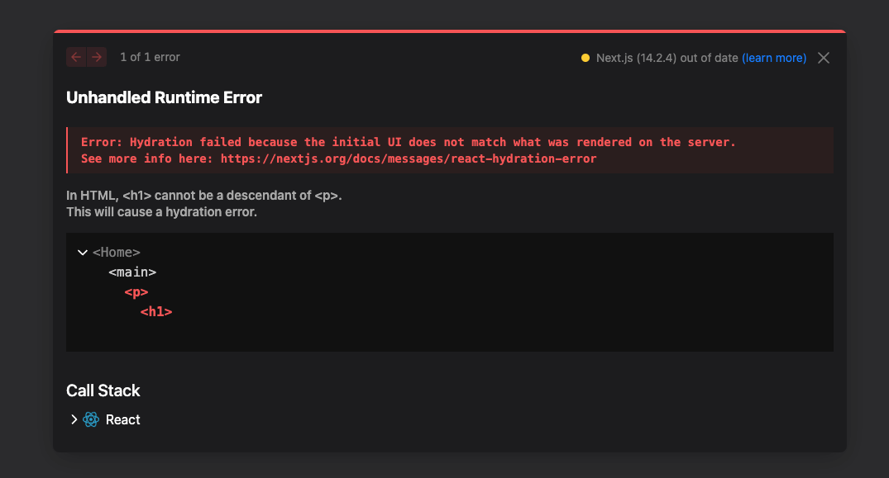
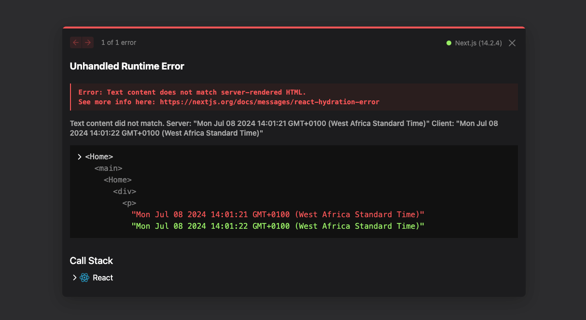

Hydration errors in Next.js and React can be a real headache, as they can mess up how your site **switches from static to interactive one**. It's one of the many bottlenecks of working with server-side rendering (SSR) in Next.js

Many claim they fix this error by passing the `suppressHydrationWarning` prop into the tag using the date or random number causing this error, but this does not apply to every situation. The safe thing to do is to dig deep and make sure there's no mismatch between the server and the client.

Let's first understand what hydration and hydration error are, and then we'll look at how to fix the error.

## What is Hydration?

In web development, particularly in a framework like Next.js, **hydration** refers to the process in which a JavaScript framework takes over a static HTML that was rendered by the server and attaches event handlers and other interactive behaviors to it.

Regarding the **hydration error** in Nex.js, it is the inconsistencies that occur when the JavaScript code running in the browser attempts to reuse the server-rendered HTML markup but finds differences it cannot resolve.

Next.js 14.2.2+ displays the error this way:



## What Causes a Hydration Error?

Differences in data rendered on the server and the client are the main course of the error. In other words, the error is an hydration mismatch. To be specific, on many occasions, hydration error is caused by the following in order:

- Incorrect tag nesting. For example, `p` tag, wrapping a `div` tag or `h1`
- the date object (`new Date()`)
- random numbers (`Math.random()`)
- third-party libraries or component libraries mismatching tags

The date object can cause issues because of timing mismatches. For example, if the server-rendered HTML includes a timestamp saying "Generated at 12:00 p.m.," it may differ from what the client sees.

By the time the client loads and hydrates the content, it might be "12:01 p.m.," causing the hydration process to detect a mismatch between the server-rendered output and the client-side JavaScript.

If you have two or more date objects in the same component, it can also cause the hydration error.

Random numbers can cause it the same reason the date object causes it.

## How to Fix a Hydration Error in Next JS and React

In the case of tags, rearrange your tag nesting so a `p` tag does not wrap an `img` or a `div`. Here are nestings that can cause the error and how to fix them:

```jsx
{
  /*incorrect*/
}
<p>
  <h1 className="text-5xl text-center mt-10">Home Page</h1>
</p>;

{
  /*correct*/
}
<h1 className="text-5xl text-center mt-10">Home Page</h1>;

{
  /*incorrect*/
}
<ul>
  <p>
    <li>First list</li>
  </p>
</ul>;

{
  /*correct */
}
<ul>
  <li>First list</li>
</ul>;
```

In cases where the date object cause it, as you can see below, the solution is a bit different.



You can see that the time on the server is **14:01:21** while the time on the client is **14:01:22**. That's a hydration mismatch between the client and the server.

This is the code that caused it:

```jsx
'use client';
import { useEffect, useState } from 'react';

export default function Home() {
  const [date, setDate] = useState(new Date());

  useEffect(() => {
    const interval = setInterval(() => {
      setDate(new Date());
    }, 1000);

    return () => clearInterval(interval);
  }, []);

  return (
    <div>
      <h1 className="text-4xl mt-4 text-center">Current Date and Time</h1>
      <p className="text-2xl text-center">{date.toString()}</p>
    </div>
  );
}
```

To fix the hydration mismatch between the client and the server in a situation where the date object causes it like this, you need to find a way to render the same value in the state the final value displayed, then conditionally render the date inside the JSX returned.

That means you should first get rid of the initial `new Date()` inside the state and set it to `null`:

```jsx del={5} ins={6}
'use client';
import { useEffect, useState } from 'react';

export default function Home() {
  const [date, setDate] = useState(new Date());
  const [date, setDate] = useState(null);

  useEffect(() => {
    const interval = setInterval(() => {
      setDate(new Date());
    }, 1000);

    return () => clearInterval(interval);
  }, []);

  return (
    <div>
      <h1 className="text-4xl mt-4 text-center">Current Date and Time</h1>
      <p className="text-2xl text-center">{date.toString()}</p>
    </div>
  );
}
```

The next thing is to conditionally render the date:

```jsx ins={18-22}
'use client';
import { useEffect, useState } from 'react';

export default function Home() {
  const [date, setDate] = useState(null);

  useEffect(() => {
    const interval = setInterval(() => {
      setDate(new Date());
    }, 1000);

    return () => clearInterval(interval);
  }, []);

  return (
    <div>
      <h1 className="text-4xl text-center mt-4">Current Date and Time</h1>
      {date ? (
        <p className="text-center text-2xl">{date.toString()}</p>
      ) : (
        <p className="text-center text-2xl">Loading...</p>
      )}
    </div>
  );
}
```

Now the client will display a `Loading…` text while the server does its job, then displays the date when everything is done.

Thank you for reading!
