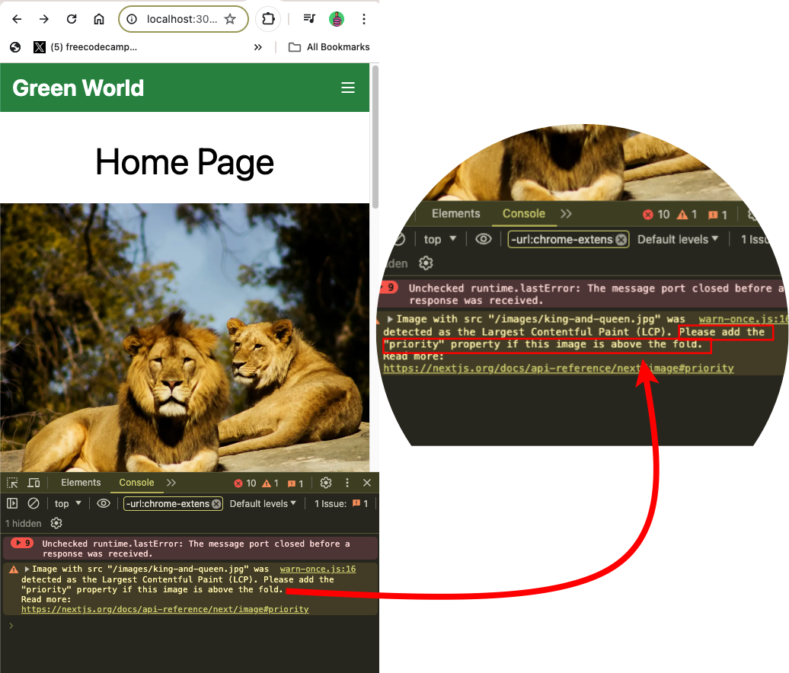
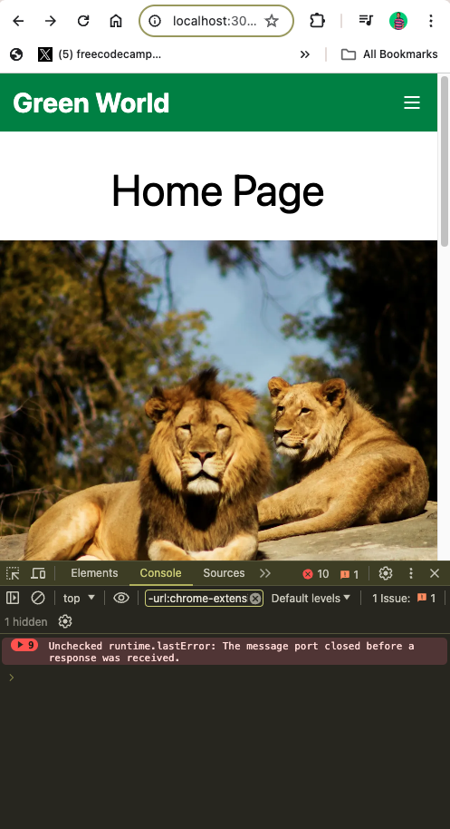

import NoteAlertBox from '../../components/blog-post-components/NoteAlertBox.astro';
import NewsletterFrameInPost from '../../components/blog-post-components/NewsletterFrameInPost.astro';

If you're working with images in Next.js, there's a probability you've come across the warning: **Image with src "/location.extension" was detected as the Largest Contentful Paint (LCP)**.

This is a warning that won't stop your application from running, but it's a dent on the performance of the application.

You probably landed on this page because you're looking for a way to get rid of the warning. Don't worry, the fix is right here for you.

But first, it's good to understand what LCP is, and why the warning is bad.

## What is the Image with src "/location.extension" was detected as the Largest Contentful Paint (LCP) Warning?

A takeaway from the warning is **Largest Contentful Paint (LCP)**. LCP is one of the Core Web Vitals, a set of metrics that Google uses to evaluate user experience on web pages.

LCP measures the time it takes for the largest content element to load and become visible in the viewport. This large content could be a video, a background image, or a block of text.

A longer LCP can negatively impact user experience, especially on slower devices or networks.

The warning, `Image with src "location.extension" was detected as the Largest Contentful Paint (LCP)` indicates that the specified image is the largest content element on the page, and its loading time is contributing to a poor Largest Contentful Paint (LCP) metric.

This warning is critical because if the image takes a long time to load, it will delay the time it takes for a user to view the most substantial part of your page content. This could affect page ranking and lead to a negative effect on user experience.

## How to Fix the `Image with src "/location.extension" was detected as the Largest Contentful Paint (LCP)` Warning

To fix the warning and make sure the image loads as fast as possible, you need to preload it.

The Next.js way of preloading an image is to set the `priority` property to `true` inside your `Next Image`. The fix is even in the warning:



This is how you would use the `property` property:

```js
<Image
  src="/images/king-and-queen.jpg"
  alt="King lion and queen lioness"
  className="object-cover h-[500px] w-full mt-8"
  width={0}
  height={0}
  sizes="100vw"
  priority="true"
/>
```

The warning has disappeared:



You can also leave the `priority` attribute without a value and the warning will dissapear:

```js
<Image
  src="/images/king-and-queen.jpg"
  alt="King lion and queen lioness"
  className="object-cover h-[500px] w-full mt-8"
  width={0}
  height={0}
  sizes="100vw"
  priority
/>
```

<NoteAlertBox>
  The `priority` property defaults to `false`. This means if you don't set it to
  any value, that's the opposite of setting it to `true`. Make sure it is set to
  `true` if the image is critical to the initial user experience and dominates
  the viewport. This is what "above the fold" means.
</NoteAlertBox>

If you're working with pure HTML, there's a `rel="preload"` you can use in a `link` tag you can use in the `head` to preload an image:

```html
<link rel="preload" as="image" href="location.extension" />
```

<NewsletterFrameInPost />

## Wrapping Up

Addressing the Largest Contentful Paint (LCP) warning in your Next.js projects is crucial for enhancing user experience, SEO, and overall site performance.

Don't forget to set the `priority` attribute to `true` if the image is a critical aspect of the page, and `false` if it's not.

**A block of text and video can also lead to a longer LCP**. If a text block causes the LCP issue, ensure web fonts are preloaded. If a video causes it, preload the poster image of the video and consider lazy loading the video itself.
