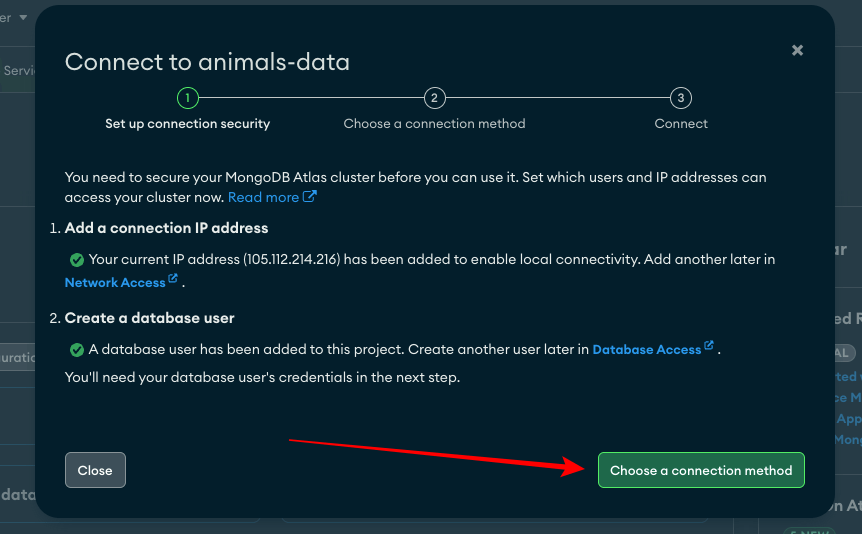
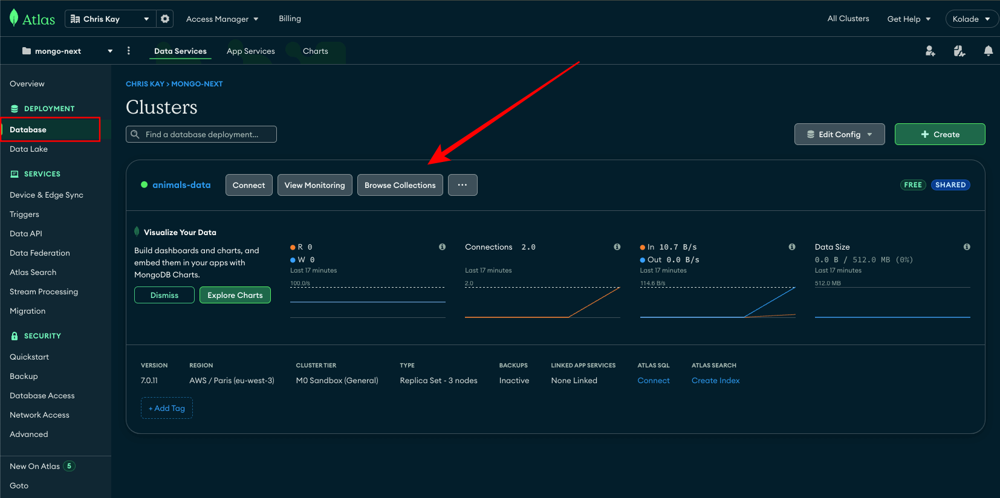
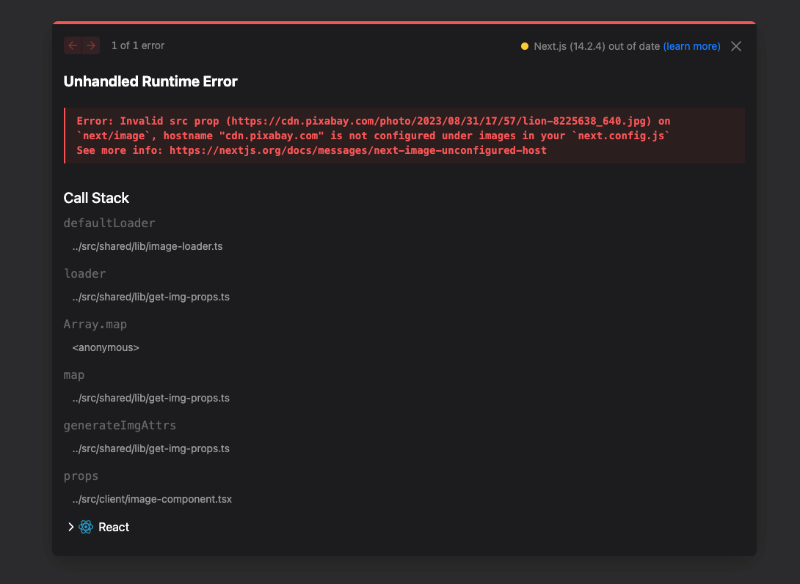

Integrating MongoDB with a Next.js application is a powerful way to create dynamic, data-driven websites and applications.

This article will guide you through the process of setting up MongoDB (using Mongoose as the ORM) to interact with your database. We'll use MongoDB Atlas to store our data on the cloud, then display the data in a Next.js application using the app router.

> There are several other ways you can achieve this. Chief amongst them is server actions with an ORM like Prisma or Drizzle. This guide will focus on doing things in the good old way we set up an Express application to integrate with a React or HTML/JavaScript project using MongoDB as the database and Mongoose as the ORM.

Before we dive into the process, here are a few things you should already know and have in place:

- A MongoDB Atlas account
- Basics of Next.js
- Basic understanding of mongoose

## Set up the MongoDB Atlas Project

Since we'll fetch the data from a MongoDB Atlas database, let's set up the database first.

### Step 1: Log in to MongoDB Atlas

Log on to mongodb.com and log in to your account, or create an account if you don't have one.

### Step 2: Create an Atlas Project

When you're in, click on the folder icon on the top-right corner and then the **New Project** button.


In the next window, give your project a name and click the **Next** button


Click **Create Project** on the next page and you'll be prompted to create a cluster.

### Step 3: Create a Cluster

A cluster is the server that will store your data. So, you need one.

Click the giant **Create** button to start the process


Select the MO free tier, name your cluster, and click the **Create Deployment** button.


As your database grows, you might need to upgrade to any of the generous free tier

### Step 4: Connect to your Database

After creating your cluster, you'll be prompted to connect to it. But first, you need to create a database user.

Enter the username and password for the database user and click the **Create Database User** button.


After that, the **Choose a connection method** button will turn green, so click it.



Select drivers in the next pop-up

After that, make sure Node JS is selected and copy the connection string, then click **Done**


### Step 5: Create Database Network Access

By default, the current IP address of your computer will only be able to access the database. You can temporarily allow access from anywhere, and then later change that based on where your app is deployed to.

To do that, select **Network Access** from the sidebar and click **ADD IP ADDRESS**


In the popup that shows up after that, click **ALLOW ACCESS FROM ANYWHERE** and **Confirm**


### Step 6: Add Data to your Database

The next thing to do is add the data to query to your database.

Click **Database** in the sidebar and then **Browser Collections**



Select **Add My Own Data**


You will then be prompted to create a database. Give your database a name (I chose fav-animals), and your collection a name (I chose animals), then click the Create button.


When you do that, you'll be directed to an interface that looks like the one you can see below:

Click the **INSERT DOCUMENT** button

Remove the existing fields and select the curly braces


Expand the JSON data below and paste it in:

```json collapse={19-156}
[
  {
    "name": "Lion",
    "scientific_name": "Panthera leo",
    "male_name": "Lion",
    "female_name": "Lioness",
    "offspring_name": "Cub",
    "description": "Lions are large carnivorous mammals known for
    their majestic appearance and social structure.",
    "image": "https://cdn.pixabay.com/photo/2023/08/31/17/57/lion-8225638_640.jpg",
    "geographic_location": "Sub-Saharan Africa",
    "litter": "2 - 6",
    "natural_enemy": "Hyenas",
    "diet": "Carnivorous",
    "life_span": 10,
    "createdAt": "2024-05-06T00:00:00.000Z",
    "updatedAt": "2024-05-06T00:00:00.000Z"
  },
  {
    "name": "Elephant",
    "scientific_name": "Loxodonta africana",
    "male_name": "Bull",
    "female_name": "Cow",
    "offspring_name": "Calf",
    "description": "Elephants are the largest land animals
     and are known for their long tusks and trunks.",
    "image": "https://cdn.pixabay.com/photo/2020/01/02/14/53/elephant-4736008_640.jpg",
    "geographic_location": "Africa, Asia",
    "litter": "1",
    "natural_enemy": "Lions",
    "diet": "Herbivorous",
    "life_span": 60,
    "createdAt": "2024-05-06T00:00:00.000Z",
    "updatedAt": "2024-05-06T00:00:00.000Z"
  },
  {
    "name": "Tiger",
    "scientific_name": "Panthera tigris",
    "male_name": "Tiger",
    "female_name": "Tigress",
    "offspring_name": "Cub",
    "description": "Tigers are large carnivorous cats known
    for their striped fur patterns and powerful hunting abilities.",
    "image": "https://cdn.pixabay.com/photo/2019/04/25/20/52/amur-tiger-4155922_640.jpg",
    "geographic_location": "Asia",
    "litter": "3 - 4",
    "natural_enemy": "Humans",
    "diet": "Carnivorous",
    "life_span": 15,
    "createdAt": "2024-05-06T00:00:00.000Z",
    "updatedAt": "2024-05-06T00:00:00.000Z"
  },
  {
    "name": "Giraffe",
    "scientific_name": "Giraffa camelopardalis",
    "male_name": "Bull",
    "female_name": "Cow",
    "offspring_name": "Calf",
    "description": "Giraffes are tall, herbivorous mammals
    known for their long necks and spotted coat patterns.",
    "image": "https://cdn.pixabay.com/photo/2021/07/01/08/48/giraffe-6378717_640.jpg",
    "geographic_location": "Africa",
    "litter": "1",
    "natural_enemy": "Lions",
    "diet": "Herbivorous",
    "life_span": 25,
    "createdAt": "2024-05-06T00:00:00.000Z",
    "updatedAt": "2024-05-06T00:00:00.000Z"
  },
  {
    "name": "Wolf",
    "scientific_name": "Canis lupus",
    "male_name": "Wolf",
    "female_name": "She-wolf",
    "offspring_name": "Pup",
    "description": "Wolves are social carnivores known for
    their pack structure and howling communication.",
    "image": "https://cdn.pixabay.com/photo/2020/06/21/14/20/wolf-5325060_640.jpg",
    "geographic_location": "North America, Europe, Asia",
    "litter": "4 - 6",
    "natural_enemy": "Humans",
    "diet": "Carnivorous",
    "life_span": 12,
    "createdAt": "2024-05-06T00:00:00.000Z",
    "updatedAt": "2024-05-06T00:00:00.000Z"
  },
  {
    "name": "Penguin",
    "scientific_name": "Spheniscidae",
    "male_name": "Penguin",
    "female_name": "Penguin",
    "offspring_name": "Chick",
    "description": "Penguins are flightless birds adapted
    for life in the water, known for their tuxedo-like appearance.",
    "image": "https://cdn.pixabay.com/photo/2022/04/03/08/37/birds-7108368_640.jpg",
    "geographic_location": "Antarctica, South America, Africa, Australia",
    "litter": "2",
    "natural_enemy": "Seals, sea lions",
    "diet": "Carnivorous (fish, krill)",
    "life_span": 20,
    "createdAt": "2024-05-06T00:00:00.000Z",
    "updatedAt": "2024-05-06T00:00:00.000Z"
  },
  {
    "name": "Dolphin",
    "scientific_name": "Delphinidae",
    "male_name": "Bull",
    "female_name": "Cow",
    "offspring_name": "Calf",
    "description": "Dolphins are highly intelligent marine mammals
     known for their playful behavior and communication skills.",
    "image": "https://cdn.pixabay.com/photo/2017/08/29/01/13/dolphin-2691864_640.jpg",
    "geographic_location": "Oceans worldwide",
    "litter": "1",
    "natural_enemy": "Sharks, killer whales",
    "diet": "Carnivorous (fish, squid)",
    "life_span": 30,
    "createdAt": "2024-05-06T00:00:00.000Z",
    "updatedAt": "2024-05-06T00:00:00.000Z"
  },
  {
    "name": "Kangaroo",
    "scientific_name": "Macropodidae",
    "male_name": "Boomer",
    "female_name": "Flyer",
    "offspring_name": "Joey",
    "description": "Kangaroos are marsupials known for their powerful
    hind legs and pouches, where they carry their young.",
    "image": "https://cdn.pixabay.com/photo/2021/09/08/02/23/kangaroo-6605269_640.jpg",
    "geographic_location": "Australia",
    "litter": "1",
    "natural_enemy": "Dingoes",
    "diet": "Herbivorous",
    "life_span": 20,
    "createdAt": "2024-05-06T00:00:00.000Z",
    "updatedAt": "2024-05-06T00:00:00.000Z"
  },

  {
    "name": "Owl",
    "scientific_name": "Strigiformes",
    "male_name": "Owl",
    "female_name": "Owl",
    "offspring_name": "Owlet",
    "description": "Owls are nocturnal birds of prey known for
    their silent flight and keen hunting abilities.",
    "image": "https://cdn.pixabay.com/photo/2021/12/21/08/29/owl-6884773_640.jpg",
    "geographic_location": "Worldwide",
    "litter": "3",
    "natural_enemy": "Large birds of prey",
    "diet": "Carnivorous (small mammals, birds, insects)",
    "life_span": 10,
    "createdAt": "2024-05-06T00:00:00.000Z",
    "updatedAt": "2024-05-06T00:00:00.000Z"
  },
  {
    "name": "Crocodile",
    "scientific_name": "Crocodylidae",
    "male_name": "Bull",
    "female_name": "Cow",
    "offspring_name": "Hatchling",
    "description": "Crocodiles are large reptiles known for their
    powerful jaws and semi-aquatic lifestyle.",
    "image": "https://cdn.pixabay.com/photo/2024/04/21/14/14/crocodile-8710743_640.jpg",
    "geographic_location": "Africa, Asia, Americas, Australia",
    "litter": "12 - 48",
    "natural_enemy": "Other crocodiles, large predators",
    "diet": "Carnivorous",
    "life_span": 70,
    "createdAt": "2024-05-06T00:00:00.000Z",
    "updatedAt": "2024-05-06T00:00:00.000Z"
  }
]
```

> Afer you've pasted in the data, if any of the values are greyish, it means there are errors. Make sure all the values are green and you'll be good to go.

Click **Insert**


## Install Next.js to Start Setting Up MongoDB in a Next.js App

Now that you're done with setting up MongoDB Atlas and filling the database with data, the next thing is to install Next.js.

Create a folder and open it with VS Code, then open the integrated terminal and run the command below:

```bash
npx create-next-app@latest
```

The installation wizard will ask you a few questions. Here are the choices I made:


When the installation is done, run `npm run dev` to start the local dev server of the application.

## Install MongoDB and Mongoose Packages

We need the Mongoose ORM and MongoDB library to effectively connect to our database and set up both our model and route. So in the terminal again, run the command below:

```bash
npm install mongodb mongoose
```

## Create Database Connection File

Create a `config` folder in the root. Inside the folder, create a `database.ts` file and paste the following in it:

```tsx
import mongoose from 'mongoose';

const connectDB = async (): Promise<void> => {
  try {
    await mongoose.connect(process.env.MONGODB_CONNECTION_URI as string);

    console.log('MongoDB connected successfully');
  } catch (error) {
    console.log('Error connecting to database...', error);
  }
};

export default connectDB;
```

What goes in the `mongoose.connect()` method is the connection string you copied in step 4.

So, create a `.env` file in the root, create a `MONGODB_CONNECTION_URI` variabel and assign the connection string to it. Make sure you replace the password with your database user password.

Also, enter the name of your database as the database to use. Otherwise, MongoDB will automatically create a `test` database for you.

The `MONGODB_CONNECTION_URI` variable should look like this:


To quickly test the connection, go to `page.tsx` inside the `app` folder. Inside the file, import the database connection file the log it to the console by invoking it:

```js
import connectDB from '@/config/database';
console.log(connectDB());
```

If you see the text `MongoDB connected successfully` (or any console message you entered in the database connection file) in the console, then everything is working fine. Otherwise, look at the error message to figure out what could have gone wrong.

On many occasions, the connection can fail because of a wrong username and password. So make sure both are correctly entered.

## Create the Database Model

The next thing is to create a model for the database. This model will define what we expect to get from the database, what we have to insert, and what we need to update. It's like a validation for what we want in the database.

Create a `models` folder in the root and an `Animal.ts` file in it. After that, import `Schema`, `model`, `models`, and `Document` all from `mongoose` and define the types for the fields:

```ts
import { Schema, model, models, Document } from 'mongoose';

interface IAnimal extends Document {
  name: string;
  scientific_name: string;
  male_name: string;
  female_name: string;
  offspring_name: string;
  description: string;
  geographic_location: string;
  litter: string;
  natural_enemy: string;
  diet: string;
  life_span: number;
}
```

After that, define the schema corresponding to the interface. Expand the code below to see the full schema:

```ts ins={17-69} collapse={17-69}
import { Schema, model, models, Document } from 'mongoose';

interface IAnimal extends Document {
  name: string;
  scientific_name: string;
  male_name: string;
  female_name: string;
  offspring_name: string;
  description: string;
  geographic_location: string;
  litter: string;
  natural_enemy: string;
  diet: string;
  life_span: number;
}

const AnimalSchema = new Schema<IAnimal>(
  {
    name: {
      type: String,
      required: true,
    },
    scientific_name: {
      type: String,
      required: true,
    },
    male_name: {
      type: String,
      required: true,
    },
    female_name: {
      type: String,
      required: true,
    },
    offspring_name: {
      type: String,
      required: true,
    },
    description: {
      type: String,
      required: true,
    },
    geographic_location: {
      type: String,
      required: true,
    },
    litter: {
      type: String,
      required: true,
    },
    natural_enemy: {
      type: String,
      required: true,
    },
    diet: {
      type: String,
      required: true,
    },
    life_span: {
      type: Number,
      required: true,
    },
  },
  {}
);

const Animal = models.Animal || model<IAnimal>('Animal', AnimalSchema);

export default Animal;
```

## Create the API Route to Query the Data

Inside the app directory, create an api folder, then an animal folder, and then a route.ts file.

Inside that route.ts file, paste the following:

```ts
import connectDB from '@/config/database';
import Animal from '@/models/Animal';

export const GET = async (request: Request): Promise<Response> => {
  try {
    await connectDB();

    const animals = await Animal.find({});
    return new Response(JSON.stringify(animals), {
      status: 200,
    });
  } catch (error) {
    return new Response(`Something went wrong: ${error}`, { status: 500 });
  }
};
```

## Query the Data

To finally query the data, head over to the page.jsx file and fetch the data from your local api route.

You can't use a useState or useEffect hook to fetch data in a server component, so you can do the fetching directly:

```tsx ins={1, 6-24}
import Image from 'next/image';

// import connectDB from '@/config/database';
// console.log(connectDB());

const fetchAnimals = async () => {
  try {
    const res = await fetch('http://localhost:3001/api/animals');
    const animalRes = await res.json();

    if (!res.ok) {
      throw new Error('Failed to fetch data');
    }
    return animalRes;
  } catch (error) {
    console.log(error);
  }
};

export default async function Home() {
  const favAnimals = await fetchAnimals();
  console.log(favAnimals);
  return <main>{/*page content*/}</main>;
}
```

## Display the Data (Animals)

Finally, you can map through the `favAnimals` data and render them on the page. Expand the code below to see how I did it and styled the elements with Tailwind CSS:

```tsx ins={20-89} collapse={20-89}
import Image from 'next/image';

// import connectDB from '@/config/database';
// console.log(connectDB());

const fetchAnimals = async () => {
  try {
    const res = await fetch('http://localhost:3001/api/animals');
    const animalRes = await res.json();

    if (!res.ok) {
      throw new Error('Failed to fetch data');
    }
    return animalRes;
  } catch (error) {
    console.log(error);
  }
};

export default async function Home() {
  const favAnimals = await fetchAnimals();
  // console.log(favAnimals);
  return (
    <main>
      <h1 className="text-center text-5xl mt-6">My Favorite Animals</h1>
      <div className="max-w-7xl mx-auto bg-[url('/wood-texture.jpg')] bg-cover p-8">
        <div className="grid grid-cols-1 sm:grid-cols-2 md:grid-cols-3 gap-6">
          {favAnimals.map((animal: any) => (
            <div
              key={animal._id}
              className="bg-white bg-opacity-90 rounded-lg shadow-md overflow-hidden"
            >
              <div className="relative h-64">
                <Image
                  src={animal.image}
                  width={400}
                  height={0}
                  alt={animal.name}
                />
              </div>
              <div className="p-4 mt-4">
                <h3 className=" font-extrabold text-2xl mb-2 text-green-500">
                  {animal.name}
                </h3>
                <p className="text-gray-700 mb-2">
                  <span className="font-semibold">Description:</span>{' '}
                  {animal.description}
                </p>
                <p className="text-gray-700 mb-2">
                  <span className="font-semibold">Male Name:</span>{' '}
                  {animal.male_name}
                </p>
                <p className="text-gray-700 mb-2">
                  <span className="font-semibold">Female Name:</span>{' '}
                  {animal.female_name}
                </p>
                <p className="text-gray-700 mb-2">
                  <span className="font-semibold">Offspring Name:</span>{' '}
                  {animal.offspring_name}
                </p>
                <p className="text-gray-700 mb-2">
                  <span className="font-semibold">Litter:</span> {animal.litter}
                </p>
                <p className="text-gray-700 mb-2">
                  <span className="font-semibold">Natural Enemy:</span>{' '}
                  {animal.natural_enemy}
                </p>
                <p className="text-gray-700 mb-2">
                  <span className="font-semibold">Trophic Level:</span>{' '}
                  {animal.diet}
                </p>
                <p className="text-gray-700 mb-2">
                  <span className="font-semibold">Life Span:</span>
                  {animal.life_span} years
                </p>
                <p className="text-gray-700 mb-2">
                  <span className="font-semibold">
                    Geographic Distribution:
                  </span>{' '}
                  {animal.geographic_location}
                </p>
              </div>
            </div>
          ))}
        </div>
      </div>
    </main>
  );
}
```

If you try to see what's going on in the browser, you'll see this error:



To fix the error, add this to the `nextConfig` object inside the `next.config.mjs` file in the root:

```js
images: {
   remotePatterns: [
     {
       protocol: 'https',
       hostname: 'cdn.pixabay.com',
     },
   ],
 },
```

Now you should see the animals rendered in the browser:

## Wrapping Up

I hope you've learned enough to be able to integrate MongoDB into your Next.js app using Mongoose as the ORM.

You can take this further by defining a `POST`, `PUT`, and `DELETE` route in the `api/animals` folder to see how those work too.

If you don't want to miss out on articles like this, consider subscribing to my newsletter.
