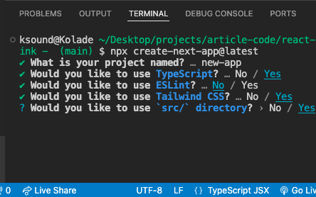
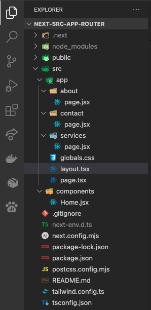
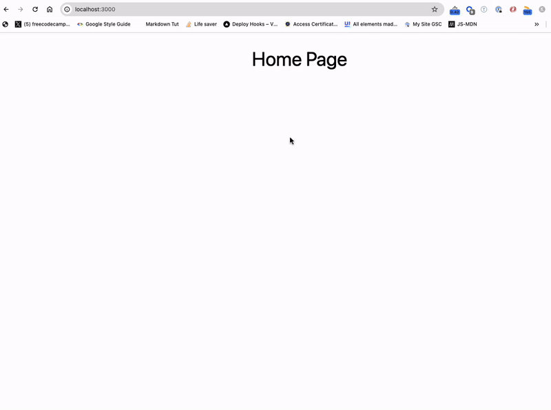
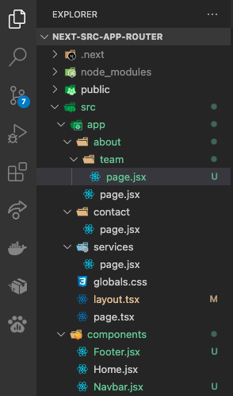
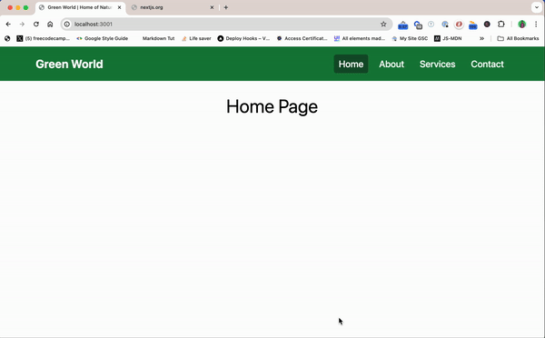

import NoteAlertBox from '../../components/blog-post-components/NoteAlertBox.astro';
import NewsletterFrameInPost from '../../components/blog-post-components/NewsletterFrameInPost.astro';

Routing is a fundamental aspect of building modern web applications. Next.js provides a powerful and flexible routing system out of the box. With it, you can easily define routes for your application using a file-based approach, allowing you to create dynamic and nested routes easily.

In this article, you'll learn how to implement file-based routing in Next.js. It doesn't end there. You'll also learn how you can implement nested routing. But firstly, let's talk about what routing is.

## What is Routing?

Routing determines what content or functionality should be displayed or executed when a user navigates to a certain URL.

So, routing is the process of mapping URLs (Uniform Resource Locators) to specific resources or actions within a website. These resources or actions could be a page, an endpoint, or a file download.

## How Does Routing Work in Next JS?

In Next JS, routing works through a file-based routing system. This means the routes are automatically generated based on the file structure of your application.
In older versions of Next JS (Next 12 and under), Next JS looks out for a `pages` directory. Whatever files you create inside the `pages` directory will be treated as a separate page. This could be `about.js`, `services.js`, and others.

As from version 13, an App Router system that implements routing a little differently was introduced. When you install Next, an `app` directory is created in the root. Inside this directory, you must create a folder that represents each page. Inside the folder, you then need to create a `page.jsx` or `page.tsx` file where you can put the content of the page.

Apart from the `page.jsx` inside the folder for each page, you can also create an `error.jsx` [or `error.tsx`] and a `loading.jsx` [or `loading.tsx`] file.

The `error.jsx` file lets you handle any unexpected error while the page loads. This approach allows you to keep the rest of the application functional when there's an error on the page.

On the other hand, the `loading.jsx` file allows you to show a loading UI or component while the content of the page loads.

<NoteAlertBox>
  During the installation of Next JS, you can also select the option that lets
  you have an `src` folder in the root. You will find the `app` directory inside
  that `src` folder.
</NoteAlertBox>

## How to Implement Routing in Next.js

### Step 1: Install a fresh Next.js Project

```bash
npx create-next-app@latest # if you're using NPM
yarn create next-app # if you're using Yarn
pnpm create next-app # if you're using PNPM
```

Make sure you select the App Router during the prompts, as this article is about how to implement routing using the App Router. You can also choose to use the `src` directory during the prompts.



### Step 2: Create the Page Folders

Create an `about`, `services`, and `services` folder inside the `app` directory, and a `page.jsx` file inside each folder. Enter texts that correspond to each page inside the `page.jsx` files.

For the home page, you can put its content inside the `app/page.js` file that comes with the installation or create a separate component for it as I'll do.

After doing that, the folder structure of your project should look like this:



You should be able to visit each page by typing the folder name in the browser address bar, for instance, `localhost:3000/about`:



## How to Implement Nested Routing in Next.js

### Step 1: Create a Subfolder Inside the Folder for the Page

To implement nested routing for a particular page, you create a folder inside the folder of that page. For instance, if you want an `about/team` page, create a `team` subfolder inside the `about` folder.

### Step 2: Create a `page.jsx` File inside the Subfolder

You then need to create a `page.jsx` inside the new subfolder, in this case, the `team` subfolder.

### Step 3: Create the Content for the Page Inside the `folder/subfolder/page.jsx` File

Add the content you want to display for the new page in the subfolder.

Here's what my folder structure looks like after creating the `about/team` nested route:



To visit the `about/team` page, append `/about/team` to your localhost address:


## Other Enhancements for the Pages

To make the pages look more elegant, you can create a navbar and footer component for the pages and use them in the `layout.jsx` file so they both can be displayed on the pages.

Here's what that looks like:



Are you interested in implementing a layout system too? I wrote an article on how to add a layout file to a Next JS website you can read.

If you want to make the navlink of the current page active, you can read my article on [how to highlight the active link in Next.js](/blog/how-to-highlight-the-active-link-in-next.js).

To better understand things, you can grab the code for this article from [the project GitHub repo](https://github.com/Ksound22/next-js-routing-aricle-code).

<NewsletterFrameInPost />

## Wrapping Up

Setting up file-based and nested routing in Next JS makes managing your web pages straightforward and efficient.

By arranging folders and files in the `app` directory, Next JS will handle most of the heavy lifting, making life easier for you and keeping things tidy and easy to understand.
