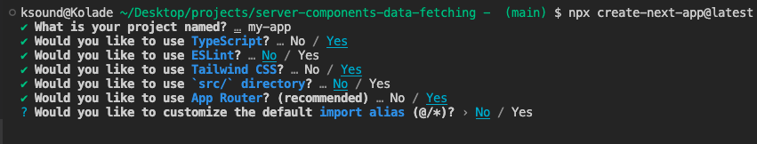
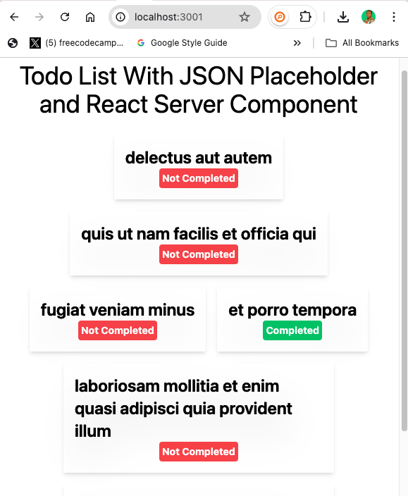

The first time I saw how to fetch data inside a React server component, **I was completely blown away**! The introduction of server components revolutionized data fetching in React applications.

If you're looking for how to fetch data in a server component using Next JS, you've come to the right place.

You won't just learn how to fetch data, because data can be within an application (for example, data from a JSON file in the same codebase), you will learn how to fetch data from an API right inside your server component.

We will use the JSON Placeholder API to fetch some todos, display them on the page, and use Tailwind CSS to style them.

## Why Would you Fetch Data in a Server Component?

There are a couple of reasons you might want to fetch data in a server component, over doing the same in a client component.

### Performance

The initial view of your application can be rendered with all the necessary data already in place, meaning the client receives a fully rendered page. This can significantly improve load time and enhance user experience, especially on slower devices or networks.

### Reduced Client-Side Load

Fetching data on the server reduces the computational load on the client. This can be beneficial for mobile users or devices with lower processing power.

### SEO Optimization

Server-rendered pages are fully populated with content when they are loaded. With this, search engines can crawl and index the pages with the content more effectively because it’s already rendered in HTML.

### Data Security

Server components enable you to keep sensitive data and business logic away from the client. For example, you can interact with APIs that require secret keys without exposing them to the client.

lorem

## How to Fetch Data in a React Server Component Using Next JS

### Step 1: Create a new Next JS project with the command below

```txt
npx create-next-app@latest # if you're using NPM
yarn create next-app # if you're using Yarn
pnpm create next-app # if you're using PNPM
```

The next thing you'll have to go through is some prompts. These are the choices I've made in the prompts:



You're free to go with your favorites during the prompt.

### Step 2: Create the Function that'll Make the API Call

To fetch the data, all you need is the `Fetch API`, no `useState` and no `useEffetct`. Here's how I did it:

```js
const fetchTodos = async () => {
  const todosURL = await fetch(
    'https://jsonplaceholder.typicode.com/todos?_start=0&_limit=14'
  );
  const todosList = await todosURL.json();

  return todosList;
};
```

> I'm limiting the todos from the API with `?_start=0&_limit=14` because there are a hundred of them.

### Step 3: Call the Function and Check the Data you Get Back

You can then call this function whenever you need the data. For example, inside the JSX of the page:

```js
export default async function Home() {
  const todoListData = await fetchTodos();

  console.log(todoListData);
}
```

### Step 4: Display the Data on the Page

Map through the data and display it on the page, like I've done below:

```js
<div>
  {todoListData.map((todo: any) => (
    <div key={todo.id}>
      <p style={{ textShadow: '#333 .2px .1px' }}>{todo.title}</p>
      <small>{todo.completed ? 'Completed' : 'Not Completed'}</small>
    </div>
  ))}
</div>
```

Here's what the whole code looks like:

```js
const fetchTodos = async () => {
  const todosURL = await fetch(
    'https://jsonplaceholder.typicode.com/todos?_start=0&_limit=14'
  );
  const todosList = await todosURL.json();

  return todosList;
};

export default async function Home() {
  const todoListData = await fetchTodos();

  return (
    <div>
      <h1>Todo List With JSON Placeholder and React Server Component</h1>

      <div>
        {todoListData.map((todo: any) => (
          <div key={todo.id}>
            <p style={{ textShadow: '#333 .2px .1px' }}>{todo.title}</p>
            <small>{todo.completed ? 'Completed' : 'Not Completed'}</small>
          </div>
        ))}
      </div>
    </div>
  );
}
```

And here's what shows in the browser after styling with Tailwind:


You can grab the full code from this [GitHub repo](https://github.com/Ksound22/next-server-component-data-fetching-article 'Next server component data fetching example').

## Wrapping Up

Fetching data in a React server component not only enhances the user experience through faster load times and improved SEO but also maintains a clean separation of concerns by keeping sensitive API logic secure on the server

Whether you are building a simple todo app or a complex app, doing data fetching with server components in Next JS is a great way to create efficient and secure web apps.
