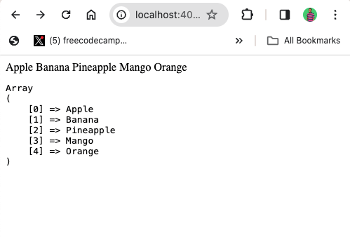

import NoteAlertBox from '../../components/blog-post-components/NoteAlertBox.astro';

Dealing with strings and arrays is an everyday task for every programmer.

PHP provides two functions that make this task easier so you don’t break a sweat. Those two functions are the `implode()` and `explode()` functions.

In this article, I’ll show you how easy it is to work with arrays and strings using the `implode()` and `explode()` functions.

## What are the `implode()` and `explode()` Functions?

The `implode()` and `explode()` functions perform opposite tasks.

`implode()` takes an array of strings and concatenates them into a single string, separating each array element with a specified `delimiter` [ or `separator`]. `explode()` on the other hand, takes a string and splits it into an array of substrings, using a specified `delimiter` to determine where to do the splitting.

## How to Use the `implode()` Function

Remember that the `implode()` function takes an array and splits it into strings(). The basic syntax of the `implode()` function looks like this:

```php
implode(separator, array)
```

- `separator` is what you want to separate each array element with. For example, `,`, `-`, or `–`
- `array` is the array you want to separate. That is, the array you want to use `implode()` on.

Here’s an example:

```php
$myStringArray = ['Apple', 'Banana', 'Pineapple', 'Mango', 'Orange'];
$implodedStringArray = implode(', ', $myStringArray);

var_dump($myStringArray);

/* array(5) {
  [0]=> string(5)
  "Apple" [1]=> string(6)
  "Banana" [2]=> string(9)
  "Pineapple" [3]=> string(5)
  "Mango" [4]=> string(6)
  "Orange"
}
*/

echo $implodedStringArray; // Apple, Banana, Pineapple, Mango, Orange
```

You can go ahead and check the type of the imploded string, and you’ll see it’s indeed a string:

```php
echo gettype($implodedStringArray); // string
```

That’s why you could echo it out in the first place!

## How to Use the `explode()` Function

The explode function takes a string and splits the element into an array. Here’s what the basic syntax looks like:

```php
explode(separator, string, limit)
```

- `separator`: specifies the character you want to use to split the string into an array
- `string`: specifies the string you want to use the `explode()` function on
  `limit` (optional): specifies the maximum number of elements to return in the array. If omitted, all occurrences of the separator in the string are used to split the string.

Here’s an example:

```php
$myString = "Apple Banana Pineapple Mango Orange";
$explodedString = explode(' ', $myString);

echo $myString . "<br>"; // Apple Banana Pineapple Mango Orange
print_r($explodedString);

/* Array (
  [0] => Apple
  [1] => Banana
  [2] => Pineapple
  [3] => Mango
  [4] => Orange
)
*/
```

<NoteAlertBox>
  I used space as the `separator` here because that’s what the strings are
  separated with.
</NoteAlertBox>

You can format the resulting array by surrounding your `print_r()` with `pre` tags:

```php
echo $myString . "<br>"; // Apple Banana Pineapple Mango Orange
echo '<pre>';
print_r($explodedString);
/*
Array
(
   [0] => Apple
   [1] => Banana
   [2] => Pineapple
   [3] => Mango
   [4] => Orange
)
*/
```



If you want the resulting array not to exceed a particular index, you can specify a limit:

```php
echo $myString . "<br>"; // Apple Banana Pineapple Mango Orange
echo '<pre>';
print_r($explodedString);
/*
Array
Array
(
   [0] => Apple
   [1] => Banana
   [2] => Pineapple Mango Orange
)
*/
echo '<pre>';
```

## Conclusion

With `implode()` and `explode()`, handling strings in PHP becomes smoother and more efficient, giving your applications that extra bit of flexibility and flair.

Whether you're putting together a string from an array or breaking down a sentence into its parts, these functions make it all a breeze.
