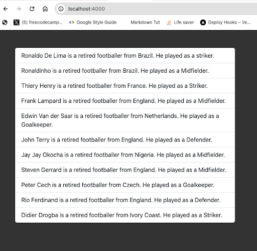

import NoteAlertBox from '../../components/blog-post-components/NoteAlertBox.astro';
import NewsletterFrameInPost from '../../components/blog-post-components/NewsletterFrameInPost.astro';

Whether you're working with a simple array of items or complex multidimensional arrays, knowing how to iterate over array elements is essential for performing various tasks and displaying data in PHP applications.

In this article, we'll explore two unique techniques for looping through arrays in PHP – `for` and `foreach` loops.

## How to Loop Through An Array with the `for` Loop

The traditional `for` loop helps you do a good job looping through arrays.

The unique thing you need to do is to get the length of the array with the `count()` function, then echo out each element of the array by accessing each element with the iteration variable you set.

Here's an example:

```php
$myFishArr = ['Tilapia', 'Penguin', 'Catfish', 'Shark'];

for ($i = 0; $i < count($myFishArr); $i++) {
 echo $myFishArr[$i] . "<br>";
}

/*
Output:

Tilapia
Penguin
Catfish
Shark
*/
```

You can take things further and access the index of each element of the array:

```php
for ($i = 0; $i < count($myFishArr); $i++) {
 $index = $i;
 echo $myFishArr[$i] . " is at index " . $i . "<br>";
}

/*
Output:

Tilapia is at index 0
Penguin is at index 1
Catfish is at index 2
Shark is at index 3
*/
```

Remember any HTML in your PHP file is the template for that PHP file. This means you can do that by looping inside the HTML in that file as well.

The only things you need to do differently is to use the `endfor` keyword to close out the for loop and specify colon (`:`) after the braces of the `for` loop:

```php
<?php
 $myFishArr = ['Tilapia', 'Penguin', 'Catfish', 'Shark'];
 ?>

 <ul class="list-group w-25 mx-5">
   <?php for ($i = 0; $i < count($myFishArr); $i++) : ?>
     <li class="list-group-item text-center"><?= $myFishArr[$i] ?> </li>
   <?php endfor; ?>
 </ul>
```

Here's how that looks in the browser:


<NoteAlertBox>
  I'm using Bootstrap to quickly style the page, which is why it looks nice.
</NoteAlertBox>

I didn't mean to interrupt...

<NewsletterFrameInPost />

Thank you, let's get back to business!

## How to Loop Through An Array with the `forEach` Loop

The `foreach` loop is a cleaner way to loop through an array as you won't deal with any length or track an iteration.

Here's what the basic syntax of `foreach` looks like:

```php
foreach ($variable as $value) {
 # code to execute...
}
```

`$variable` is the array you're looping through and `$value` is what you want each item of the array to be called.

Here's an example:

```php
foreach ($myFishArr as $fish) {
 echo $fish . "<br>";
}

/*
Output:

Tilapia
Penguin
Catfish
Shark
*/
```

If you want to get the index of each value in the array, you need to map a `$key` to each value:

```php
foreach ($myFishArr as $key => $fish) {
 echo $fish . " is at index " . $key . "<br>";
}

/*
Output:

Tilapia is at index 0
Penguin is at index 1
Catfish is at index 2
Shark is at index 3
*/
```

`foreach` is also a convenient way to extract what you want from an array. For instance, you can extract the role of each footballer in the array below by accessing the `role` key with a square bracket:

```php collapse={2-10}
$retiredFootballers = [
 ['name' => 'Ronaldo De Lima', 'role' => 'striker', 'country' => 'Brazil'],
 ['name' => 'Ronaldinho', 'role' => 'Midfielder', 'country' => 'Brazil'],
 ['name' => 'Thiery Henry', 'role' => 'Striker', 'country' => 'France'],
 ['name' => 'Frank Lampard', 'role' => 'Midfielder', 'country' => 'England'],
 ['name' => 'Edwin Van der Saar', 'role' => 'Goalkeeper', 'country' => 'Netherlands'],
 ['name' => 'John Terry', 'role' => 'Defender', 'country' => 'England'],
 ['name' => 'Jay Jay Okocha', 'role' => 'Midfielder', 'country' => 'Nigeria'],
 ['name' => 'Steven Gerrard', 'role' => 'Midfielder', 'country' => 'England'],
 ['name' => 'Peter Cech', 'role' => 'Goalkeeper', 'country' => 'Czech'],
 ['name' => 'Rio Ferdinand', 'role' => 'Defender', 'country' => 'England'],
 ['name' => 'Didier Drogba', 'role' => 'Striker', 'country' => 'Ivory Coast'],
];

foreach ($retiredFootballers as $retiredFootballer) {
 $role = $retiredFootballer['role'];

 echo $role . "<br>";
}

/*
Output:

striker
Midfielder
Striker
Midfielder
Goalkeeper
Defender
Midfielder
Midfielder
Goalkeeper
Defender
Striker
*/
```

As you've seen, the `$retiredFootballer` array has a `name`, `country`, and `role` keys. That's a chance to be creative when you want to do the looping in your HTML template:

```php
<ul class="list-group mx-5" style="width: 40%;">
   <?php foreach ($retiredFootballers as $retiredFootballer) : ?>
     <li class="list-group-item"><?= $retiredFootballer['name']
     . ' is a retired footballer from ' . $retiredFootballer['country'] .
     '.' . ' He played as a ' . $retiredFootballer['role'] . '.' ?> </li>
   <?php endforeach; ?>
 </ul>
```



## Wrapping Up

Mastering the `for` and `foreach` loops will increase your confidence in looping through arrays of any size and complexity, making your PHP code more expressive and powerful.

Some array functions, like `array_map()` and `array_filter()`, also provide ways to extract what you want from an array and even apply a callback function, but they're technically not loops.
