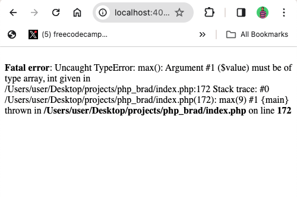

PHP, like every other programming language, allows you to perform mathematical calculations and provides `math` functions for manipulating numbers.

In this article, we’ll examine 10 PHP `math` functions, what they do, and how to use them.

Here are those PHP `math` functions we’ll look at:

- `abs()`
- `rand()`
- `ceil()`
- `floor()`
- `round()`
- `pow()`
- `sqrt()`
- `min()`
- `max()`
- `pi`
- `number_format()`

## The `abs()` Function

"abs" in the `abs()` function means "absolute". This means it returns the positive value of a number.

To use the `abs()` function on a number, you pass the number into it:

```php
$myNegativeNum = -40;
echo abs($myNegativeNum); // 40


echo abs(-120); // 120;
```

## The `rand()` Function

The `rand()` function generates a random integer of any number of figures depending on your system configuration:

```php
echo rand(); //15059801
```

If you keep reloading the server, you’ll keep getting different numbers:

```php
echo rand(); //1495051557
```

To see the maximum value that `rand()` can return, you can use `getrandmax()`. For me, that figure is `2147483647`:

```php
echo getrandmax(); // 2147483647
```

If you pass in two numbers into the `rand()` function, it will generate the random number between those numbers:

```php
//syntax: rand(min, max);
echo rand(1, 10); //6
echo rand(1, 10); //5
echo rand(1, 10); //9
```

## The `floor()` Function

The `floor` function is used to "round down" a floating-point number to the nearest whole number (integer):

```php
echo floor(43.2); // 43
```

Even if the number is closer to the next integer, it would still be rounded down:

```php
echo ceil(43.9); // 43
```

## The `ceil()` Function

The `ceil` function is the opposite of `floor()`. It rounds up a floating-point number to the nearest whole number:

```php
echo ceil(43.9); // 44
```

And if the number is closer to the whole number before it, it would still be rounded up:

```php
echo ceil(43.3); // 44
```

## The `round()` Function

The `round()` function rounds a floating-point number to the nearest whole number. It’s a hybrid of the `ceil()` and `floor()` functions.

If the number is closer to the whole number (integer) before it, it would be rounded down:

```php
echo round(2.3); // 2
```

And if the number is closer to the next whole number (integer), it would be rounded up:

```php
echo round(1.8); // 2
```

## The `pow()` Function

The `pow` function takes two required numbers and then raises the first number to the power of the second.

See these two numbers as `base` and `exponent`. Here’s an example:

```php
$base = 2;
$exponent = 4;


echo pow($base, $exponent); // 16
```

## The `sqrt()` Function

`sqrt` stands for square root. So, if you want to get the square root of any number, pass in that number into the `sqrt()` function:

```php
echo sqrt(16); // 4
echo sqrt(64); // 8
echo sqrt(81); // 9
```

## The `min()` Function

The `min` function returns the minimum number within the numbers passed into it.

```php
echo min(2, 4, 1, 5); // 1
```

This means a single argument is invalid in it:

```php
echo min(1);
```


```php
$myNumArr = [3, 6, 9, 2];
echo min($myNumArr); // 2
```

## The `max()` Function

The `max()` function finds the highest number within the numbers passed into it. Apart from that, everything about `min()` is applied to `max()`.

```php
echo max(2, 4, 1, 5); // 5
```

You can use it to find the highest number in an array of numbers:

```php
$myNumArr = [3, 6, 9, 2];
echo max($myNumArr); // 9
```

`max()` will also return an error if only one number is passed into it:

```php
echo max(9);
```



You probably learned about `pi` during your elementary (or primary) school days. You’re not mistaken. It’s the same `pi`.

This function does not need anything to be passed into it, it returns the `pi` number:

```php
echo pi(); // 3.1415926535898
```

## The `number_format()` Function

## Wrapping Up

Understanding the PHP `math` functions is critical to making efficient web apps that handle calculations and other math-related operations.

Apart from the `math` functions discussed in this article, there are many others – including those that handle trigonometric calculations such as `sin`, `tan`, and `cos`.

You can check those functions in the official [PHP documentation for the Math functions](https://www.php.net/manual/en/ref.math.php).

Check out my other [PHP articles](https://www.koladechris.com/blog/tag/php 'More PHP Articles from Kolade')
