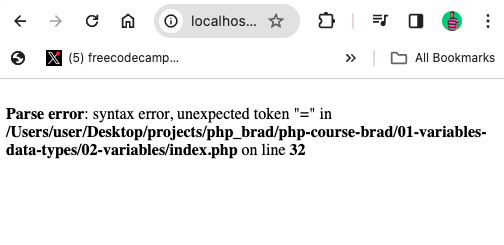
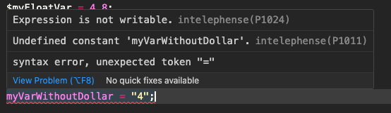
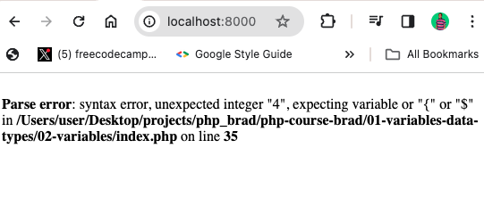
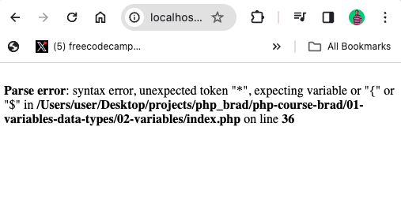
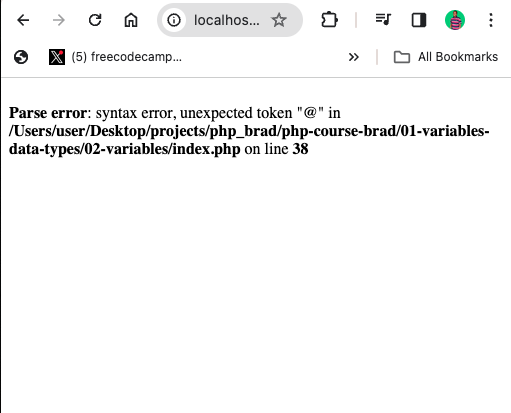
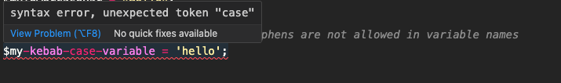

Variables are a fundamental concept in PHP and other programming languages.

A variable is a name that represents a value stored in computer memory. It's essentially a container for storing data that can change during the execution of a program.

As the execution of the program continues, variables let you manipulate and work with data in a dynamic manner.

## How to Declare a Variable in PHP

In PHP, a variable is declared using the dollar sign (`$`), followed by the variable name. For example, `$variableName`, `$variable_name`, `$VariableName`, or `$variable-name`. The data you save in the variable could be any relevant PHP data type such as `string`, `integer`, `float`, `array`, `object`, or `null`.

```php
// a variable of string data
$MyStringVar = 'PHP is awesome';

// a variable of number data
$my_num_var = 22;

// a variable of float data
$my-float-var = 4.8;

// a variable of array data
$myArrVar = ["One", 2, true];
```

## Rules for Declaring Variables in PHP

As you can see, the `variable name` is in many forms. That’s because there are rules and conventions for declaring variables in PHP.

Here are some of those rules:

### **Rule 1**: All variables should be prefixed with a dollar sign (`$`)

If you declare a variable without prefixing it with the dollar sign, PHP will throw a syntax error in the browser:



The PHP's parser relies on the dollar sign (`$`) to recognize variables. This fundamental aspect of PHP has existed since Rasmus Lerdorf created the language in 1994.

If you hover that variable in VS Code and you have a linter set up, you’ll see the variable with a squiggly red line:



PHP won't recognize that “variable” as a variable, and it will be treated as a constant. If that constant does not exist, PHP will throw the error.

### **Rule 2**: All variable names must start with a letter or underscore (`_`)

This means you cannot start a variable name with a number or symbol.

If you start the variable name with a number, like `$4name = 'a variable starting with a number';` PHP will throw an unexpected integer syntax error, with that integer indicated:



If you start a variable name with a symbol other than the dollar sign, like `$*varName = 3;` PHP will throw an unexpected token error:



### **Rule 3**: Variable names can only contain letters, numbers, and underscore (`_`)

This means you cannot have other special characters in a variable other than underscore (`_`).

> Remember you can only start the variable name with a letter and an underscore, not numbers and other special characters.

If you insert a special character into the variable name, an unexpected token error will be thrown.

```php
$my@var = 45;
```



> Notice the unexpected token is that symbol you used in the variable, just like it happens when you start the name of the variable with a symbol other than underscore(`_`).

## Conventions for Declaring Variables in PHP

There are several conventions for declaring variables that are commonly followed by PHP developers.

While PHP doesn't enforce the conventions, adhering to them can improve code readability and maintainability, especially when working in a team or on larger projects.

Here are some common conventions:

### Convention #1: Use any of `camelCase`, `PascalCase`, `lowercase`, or `sanke_case`

PHP does not enforce a certain case for declaring variables – just as it is in many programming languages.

This means you can use any case you want. It is advised you stick to a certain case in your codebase, so you and other developers who are working on that project can know what’s going on.

Here are the cases you can use:

```php
// snake case is separated by an underscore
$my_snake_case_var = 'Hello';

// The first letter in a camel case starts with a small letter, then others start with capital letters
$myCamelCaseVar = 'Hello';

// All the first words in a pascal case start with a capital letter
$MyPascalCaseVar = 'Hello';

// All the words in lowercase variable are small letters with no separator
$mylowercasevar = "Hello";
```

You cannot use `kebab-case` in PHP because using a hyphen in a variable name will result in an unexpected token error:



### Convention 2: Avoid Single-letter Names

While short variable names like `$i`, `$j`, and `$x` are commonly used in loops, avoiding single-letter variable names in other contexts is a good practice.

Using descriptive names improves code readability and reduces the risk of naming conflicts.

### Convention #3: Use Descriptive Names

Choosing variable names that accurately describe the data they represent is a good practice. For example, `$first_name` instead of `$fi` or `$f`, `$last_name` instead of `$l` or `$li`

This makes your code self-explanatory and easier to understand for other developers.

### Convention #4: Start Variable Names with their Data Types

Some PHP developers would start a variable name with the data type for that variable. This is not a common convention.

So, instead of variables like these:

```php
$username = "john-doe";
$age = 30;
$colors = ["red", "green", "blue"];
$isMarried = false;
```

You’ll see variables like these:

```php
$strUsername = "john-doe";
$intAge = 30;
$arrColors = ["red", "green", "blue"];
$boolIsMarried = false;
```

## Wrapping Up

While PHP does not enforce some of the conventions for declaring variables, the language enforces the rules. That’s why PHP throws several errors when you don’t adhere to those rules.

Mastering the rules and conventions of creating strings in PHP is essential for writing clean, readable, and maintainable code. Following the conventions for code readability and maintainability is advised, especially if you’re working in a team or on a large project.
