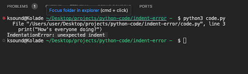

Unlike many other programming languages, Python relies on indentations to define blocks of code instead of braces.

So, when you fail to indent your code the right way, Python will throw the error `IndentationError: unexpected indent`.

For example, let's say you have a function `greet` inside which you're printing some greeting messages:

```py
def greet():
   print("Hello  world")
    print("How's everyone doing?")

greet()
```

The problem with this code is that the second `print()` function is indented two levels deep, even though there's nothing nested in the first line of code inside the function. This will throw the error `IndentationError: unexpected indent`.



## How to Fix Unexpected Indent in python

When Python throws this error, the problematic line of code is shown, so all you need to fix the error is to indent that line of code by pushing it one tab forward or backward, depending on the need.

For example, in the `greet` function, the second `print()` function has to be pushed back a tab:

```py
def greet():
   print("Hello  world")
   print("How's everyone doing?")


greet()
```

If it happens you have multiple blocks inside a function, every code in the block must be indented one level:

```py
def greet():
 if True:
   for i in range(3):
     print("This is inside both the if block and the for loop")

greet()
```

Thank you for reading!
